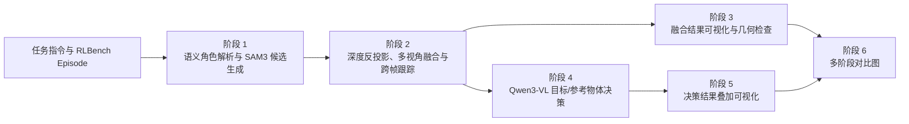

# RLBench 任务相关物体识别项目报告

## 1. 文档信息

| 项目 | 内容 |
| --- | --- |
| 项目名称 | Relevant Object Grounding for RLBench |
| 报告周期 | 2026-07-29 至 2026-08-03 |
| 当前分支 | `main` |
| 报告目的 | 项目阶段汇报、方案说明与后续规划 |

## 2. 项目摘要

本项目面向 RLBench 机器人操作示范，目标是从多相机 RGB、深度图、相机参数和自然语言任务指令中，识别当前操作所涉及的目标物体与参考物体，并在整个 episode 内保持物体身份和任务角色的一致性。

当前已形成由 Qwen3-VL、SAM3、多视角三维融合、时序跟踪和动态角色推理组成的端到端处理链路。系统能够输出逐视角候选、跨视角融合物体、跨帧物体轨迹、逐帧目标/参考物体判断，以及用于人工检查的多阶段可视化结果。

本阶段的核心工作，是推动项目从“单帧、单阶段能力验证”向“可分阶段运行、可复用中间结果、可追踪问题、可持续维护”的 episode 级工程方案演进。

## 3. 项目背景与目标

机器人操作任务中的“相关物体”并不等同于单纯的物体检测结果。例如，在“把杯子放到架子上”任务中，系统不仅需要识别杯子，还需要区分当前目标、放置位置、交互部位，以及这些角色随操作进度发生的变化。

项目需要解决以下问题：

1. 从自然语言任务中提取目标、参考物体、交互部位和空间关系。
2. 在多个相机视角中生成高召回率的实例候选。
3. 将不同视角中的同一实体融合为统一、角色中立的物体 ID。
4. 在 episode 时间维度上保持稳定的物体身份。
5. 根据视觉语义、机械臂交互和三维关系判断当前目标与参考物体。
6. 提供可检查、可回放的中间产物和可视化，支持问题定位与参数调优。

## 4. 整体技术方案

### 4.1 语义角色解析与候选生成

- 使用 Qwen3-VL 将任务指令转换为不依赖边界框的角色描述，包括 `target`、`reference`、`interaction_part` 和 `relation`。
- 使用 SAM3 在选定帧和相机上生成实例掩码、裁剪图及候选清单。
- 对断开的掩码区域进行拆分，并通过面积过滤、掩码 NMS、包含关系和多实例掩码抑制减少明显噪声。
- 支持复用已有 `role_spec.json`，避免重复执行语义解析。

### 4.2 多视角三维融合与时序跟踪

- 结合深度图和相机内外参，将二维候选反投影为世界坐标系点云。
- 使用角色中立的 `O*` ID 表示物理实体，避免候选阶段的语义标签直接绑定最终物体身份。
- 使用锚点相机分配和相机内一对一匹配替代简单的传递式聚类，控制错误链式合并。
- 通过中心点距离、三维包围盒、最近点距离、点云直径、尺寸比例和可见性检查约束融合结果。
- 对同相机重复候选执行严格的二维与三维联合 NMS。
- 使用体素连通性、主连通分量比例和次级分量比例识别被污染或错误拼接的点云。
- 在相邻采样帧之间进行物体 ID 跟踪，并允许短时间遮挡后恢复原有 ID。

### 4.3 目标与参考物体决策

- 阶段 4 使用融合后的 `object_summary.json`，而不是直接使用 SAM3 的角色标签。
- 每个采样帧均可生成决策；默认采用自适应关键帧策略，在稳定帧复用语义结果，并重新计算当前几何、夹爪状态和动态角色。
- 使用滚动时间窗口评估物体接近、运动、抓取、释放、支撑和包含关系。
- 将语义兼容性与确定性的物理状态检查分离，保留模型原始结果和调整依据，便于复核。
- 支持 `PRESSED`、`OPEN`、`ON`、`IN`、`INSERTED_IN` 等目标谓词，不依赖具体 RLBench 任务名称进行硬编码分支。

### 4.4 可视化与可解释性

- 阶段 3 将融合点云回投影到固定相机视图，并生成包含三维点云视图的逐帧 montage。
- 同一物体在不同相机和不同帧中使用一致颜色。
- 阶段 5 将最终目标和参考物体直接替换为 `T*`、`R*` 标签，避免重复标签遮挡小物体。
- 阶段 6 汇总候选、融合和决策结果，支持快速比较错误来自哪一阶段。
- 输出中保留模型调用来源、传播来源、刷新原因、置信度组成和耗时统计。

## 5. 本阶段完成的主要工作

### 5.1 核心流程完善

- 完成候选生成、多视角融合、角色决策和可视化的端到端串联。
- 支持按阶段独立执行、跳过高成本阶段和复用中间结果。
- 将阶段 4 扩展为逐帧滚动决策，并统一时间窗口语义。
- 增加全图场景输入模式，减少只看局部裁剪时丢失上下文的问题。

### 5.2 融合质量控制

- 将融合算法调整为锚点分配，降低传递式聚类造成的误合并风险。
- 增加同视角重复候选 NMS、尺度无关的包围盒一致性和替代几何匹配线索。
- 增加中心点到点云距离、最小候选面积和体素连通性等过滤机制。
- 完善多相机可见性与遮挡判断，避免机械地删除合理的单视角物体。

### 5.3 时序与决策稳定性

- 保存完整逐帧决策结果，修复逐帧决策初始化及历史记录相关问题。
- 增加无效物体 ID 校验，防止模型返回不存在的对象。
- 支持自适应 Qwen 关键帧调用与逐帧传播，减少稳定片段中的重复推理。
- 引入动态角色推理，维护抓取、释放、放置和容器关系等 episode 级状态。

### 5.4 工程化与维护性

- 将相机几何、掩码几何、融合匹配、公共 I/O、模型运行时和可视化工具拆分为独立模块。
- 建立版本化的三层输出结构和 JSON Schema，并将大体积点云独立保存为压缩 NPZ。
- 对关键 JSON 写入和点云归档使用可恢复、可替换的输出方式。
- 增加候选生成、相机几何、融合、动态角色推理、决策和可视化测试。
- 更新主 README、中文说明和阶段说明文档。

### 5.5 开发环境稳定性

- 定位 Windows 开发环境中 VS Code 异常退出与系统虚拟内存不足有关。
- 增加工作区级文件监听与搜索排除建议，降低大规模输入图片对编辑器资源的影响。
- 将 VS Code 工作区终端调整为 Command Prompt，并保留 Git Bash/Conda 的运行方式。

## 6. 阶段成果与项目价值

| 维度 | 阶段成果 | 价值 |
| --- | --- | --- |
| 完整性 | 建立六阶段 episode 级处理链路 | 支持从原始数据到最终决策的一次性处理 |
| 一致性 | 统一跨相机、跨帧物体 ID | 为后续策略学习和轨迹分析提供稳定对象索引 |
| 稳定性 | 增加多层几何和点云质量约束 | 降低重复候选、误融合和污染点云进入决策阶段的风险 |
| 效率 | 支持恢复执行、中间结果复用和自适应模型调用 | 减少重复模型推理和调参成本 |
| 可解释性 | 输出逐阶段可视化、诊断字段和性能统计 | 缩短问题定位路径，支持人工复核 |
| 可维护性 | 拆分公共模块、建立 Schema 和测试 | 降低后续功能扩展与接口变更风险 |

从 2026-07-29 的基线到当前版本，仓库累计涉及 35 个文件，代码和文档净增加约 7,900 行。该数据反映工程建设规模，不代表模型效果指标。

## 7. 当前验证状态

### 已完成验证

- `run_full_pipeline.sh` 已通过 Bash 语法检查。
- 各核心阶段均已提供命令行入口和参数校验。
- 仓库包含 7 个测试模块，覆盖相机几何、候选生成、融合、动态角色推理、决策和可视化。
- 中间结果支持跳过上游阶段后单独复跑下游逻辑。

### 尚待补充验证

- 当前 Windows 基础 Conda 环境尚未安装 `pytest`，因此本次文档整理未能在本机重新执行完整测试集。
- 尚未形成跨任务、跨 variation 的统一准确率、召回率、误融合率和运行耗时基准。
- 模型权重、SAM3 代码及支持 Qwen3-VL 的 Transformers 环境不随仓库分发，需要在目标运行环境中单独确认。
- 完整 GPU 端到端回归需要在具备模型、RLBench 数据和足够显存的服务器环境执行。

因此，当前结论是“核心能力和工程链路已形成”，但不应将其表述为“准确率已达到生产标准”。

## 8. 风险与限制

| 风险 | 影响 | 当前措施 |
| --- | --- | --- |
| SAM3 与 Qwen3-VL 环境未锁定版本 | 新环境可能出现接口或加载差异 | 优先复用已验证环境；交接时记录环境快照 |
| 模型和数据不随仓库分发 | 新接手人无法仅凭代码完成全流程 | 交接清单中单独确认模型与数据权限 |
| 几何阈值依赖数据尺度和相机质量 | 不同任务上的最优参数可能不同 | 所有关键阈值均已暴露为环境变量 |
| 抓取后物体被夹爪遮挡或与夹爪外观相近 | 掩码可能丢失、粘连到夹爪，导致融合对象消失或跨帧 ID 中断 | 当前通过短时漏检容忍和多视角观察缓解；后续增加“物体附着于夹爪”的显式跟踪状态 |
| 缺少统一量化基准 | 无法客观判断改动收益 | 下一阶段建立固定任务集和指标脚本 |
| Qwen 输出仍可能出现语义误判或格式异常 | 影响目标/参考物体选择 | 增加候选校验、不确定标记和后续帧刷新 |
| Windows 本地环境资源有限 | 不适合完整模型回归 | 本地进行静态检查，GPU 服务器进行模型测试 |

## 9. 下一阶段计划

### 优先级 P0：建立可重复评测

1. 固定一组覆盖抓取、放置、插入、开关和重复操作的 RLBench episode。
2. 定义候选召回率、融合纯度、ID 切换次数、目标选择准确率和单 episode 耗时。
3. 保存默认参数基线以及每次算法调整后的对比结果。

### 优先级 P1：提升困难场景表现

1. 针对小物体、遮挡、相似实例和单相机可见物体进行专项分析。
2. 针对抓取后的检测丢失建立专项评测，重点覆盖物体与夹爪颜色或纹理相近的场景。
3. 在检测到可靠抓取事件后建立 `attached-to-gripper` 状态：候选暂时消失时，根据夹爪位姿维持物体 ID，并在重新可见后完成重关联。
4. 调整候选面积、相机支持、连通分量和时序跟踪参数。
5. 分析全图模式与局部裁剪模式在不同任务上的适用范围。

### 优先级 P1：完善环境可复现性

1. 导出已验证 Conda/Pip 环境及 CUDA、PyTorch、Transformers、SAM3 版本。
2. 增加最小样例数据或数据检查脚本。
3. 在 GPU 环境执行完整测试和小样本端到端验收。

### 优先级 P2：形成演示与交付材料

1. 选择代表性任务生成阶段对比图和失败案例。
2. 汇总性能统计与量化结果。
3. 将常用配置固化为可复用的运行配置文件或批处理脚本。

## 10. 结论

项目已完成从自然语言任务理解、二维候选生成、多视角三维融合、跨帧跟踪到目标/参考物体决策的主体工程链路，并建立了中间结果复用、诊断可视化、结构化输出和自动化测试基础。

下一阶段的重点不再是继续扩展流程长度，而是通过固定数据集和统一指标验证现有方案，量化准确性、稳定性和效率，并据此收敛默认参数和运行环境。
