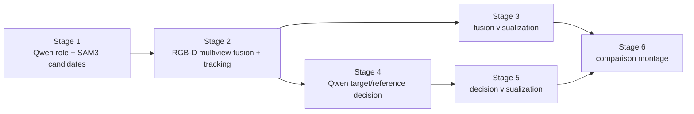
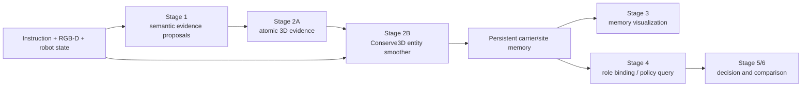

# Conserve3D：机器人交互驱动的回溯式世界拓扑修复

> 高层整体 idea 先读：[`CONSERVE3D_IDEA_OVERVIEW_CN.md`](CONSERVE3D_IDEA_OVERVIEW_CN.md)

> 文档类型：研究方案与实施设计草案  
> 面向项目：RLBench Relevant Object Grounding  
> 文献边界：截至 2026-08-04 的公开论文与预印本  
> 状态：v0.14，主论文进一步收敛为 Conserve–Test–Repair 闭环；TCIO 仅作为下游验证接口与潜在后续工作

## 0. 执行结论

当前项目的核心问题不应继续描述为“如何调好 object matching”。更准确的问题是：

> SAM3/Qwen/多视角候选是会分裂、合并、漏失和跳变的观测；系统却过早把这些观测当成了世界中的对象。

统一原则是：**observation topology 可以快速改变；物理实体是假设而不是检测结果；假设默认守恒、必须预测交互结果，并在预测被后续证据否定时回溯修订历史 world topology。**

建议将下一阶段方法收敛为 **Conserve3D**：一个由交互检验和历史修订驱动的、可版本化的持久 world interpretation。核心假设是：

1. **世界实体在普通观测帧之间守恒**，不能因为检测器多画或少画一个 mask 就出生或死亡。
2. **观测拓扑可以任意变化**：同一实体可产生多个候选，一个候选也可覆盖多个实体。
3. **离散场景拓扑只在物理事件附近改变**：抓取、释放、插入、打开、关闭、进入或离开视野等事件是状态转换的门。
4. **功能部位依附于物理载体**：孔、把手、按钮、放置区域不是孤立对象，而是带局部坐标和功能语义的 task site。
5. **任务角色不等于身份**：target/reference 是指令条件下对持久实体或 task site 的查询结果，不能参与底层 ID 的创建。
6. **不可辨识不是跟踪失败**：证据不足时维持身份等价类和概率；只有任务确实依赖历史个体时，才要求进一步消歧。

### 0.5 Entity 的来源与初始化契约

实体变量是对不可变 evidence 的解释，不是 SAM/Qwen 的直接输出。初始化时只创建带相机、帧、像素/点云 provenance 的 observation fragments；随后由多视角几何、持续性、共同运动、接触和功能语义生成一个或多个 entity/site hypotheses。没有足够证据时不创建确定 UUID，而保留可回溯的 cardinality、coverage 和关系 hypotheses；插孔中的 hole 以依附于底座 carrier 的 site hypothesis 进入 world belief，遮挡期间由 parent pose/接触证据传播。

### 0.6 Candidate-to-entity 的解释选择原则

候选归属不通过逐帧最近邻或单一 appearance score 决定，而由整个 episode 的 world hypotheses 共同解释：一个 candidate 对多个 entity 的 incidence、多个 candidate 对一个 entity 的 coverage，以及暂时无观测的 entity 都是合法状态。候选归属的 posterior 同时受历史 observation fit、交互结果预测、必要 topology edit cost 和不可辨识性约束；只有某个解释在这些约束下明显占优时，才向下游提供 resolved address，否则返回 identity class/posterior。

### 0.7 Causality-safe retrospective protocol

在线决策时，版本 \(W_t\) 只能由 \(t\) 及之前的 evidence 生成；任何未来交互结果都不得泄漏到已经执行的动作。新证据到达后可创建 \(W_{t+1}\)，在固定历史窗口内修订旧的 topology interpretation，并将修订后的版本提供给后续查询和规划，但不回写原始 evidence，也不重写已经发生的 action。实验必须将 online execution、future-query benefit 与 retrospective history accuracy 分开报告。

### 0.8 Evidence semantics

观测 evidence、持续性 evidence 和 intervention evidence 不采用同一语义：appearance/geometry 主要增加支持，visibility/persistence 约束可行历史，grasp/contact/co-motion/reappearance 才提供区分或证伪。它们可以共同进入 posterior，但不能把 interaction 简化为一个与颜色、距离等价的 matching feature；interaction 的作用是改变可行 topology hypotheses 的集合。

### 0.9 Role query contract

`target`、`reference`、`support` 和 `previously_placed` 是对 task-independent world belief 的 typed queries，不是当前帧对象的固有字段。Qwen 可以解析指令中的类别、关系和约束，但不能用一次输出创建或改写 physical identity；查询应返回持久 address、候选集合或 unresolved posterior，并在 topology revision 后重新解析同一语义 role。

### 0.10 三段式评测协议

评测按时间因果分成三段，而不是把整个 episode 的最终标签直接用于当前帧：

1. **Online belief**：在动作时只使用当时的 world version，评估 existence/visibility、当前 topology 和安全查询；
2. **Retrospective revision**：未来事件到达后，在规定 fixed-lag 窗口内重建历史，评估 cardinality、observation-to-entity coverage、site ownership、event participant 和 edit provenance；
3. **Future query/execution**：将新版本提供给后续 role/site query 和 policy，评估地址 switch、false commitment、任务成功率与必要 abstention。

报告必须同时包含 revision 前后差值、在线执行结果和普通 MOT/RFS smoother 对照；只提高离线历史重建而不改善后续查询或动作的系统，不算主方法成功。

该设计统一处理当前观察到的五类失败：

| 失败 | 在 Conserve3D 中的解释 |
| --- | --- |
| O4/O10 是同一物体却产生两个 ID | 一个 carrier，由多个 observation fragments 解释 |
| 上下堆叠方块被 SAM3 合为一个 mask | 一个 merged observation，同时覆盖两个既存 carriers |
| 抓取后物体被夹爪遮挡而丢失 | carrier 仍存在，关系转为 `attached_to(gripper)` |
| 孔后续完全不可见 | hole site 仍依附底座 carrier，通过母体位姿传播 |
| target/reference 频繁跳变 | 角色绑定在持久 carrier/site 上，而不是当前帧 O-ID 上 |

最值得投稿的创新点不是“持久 object slots”“动作历史”或“功能 scene graph”，也不能继续承诺任何时候都恢复唯一 ID，而是：

> **将会 split、merge、miss 和重现的 foundation observations 与默认守恒的物理 world topology 解耦，并利用机器人交互结果跨时间回溯修订 entity–site topology，而不是把每帧 segmentation 直接固化成世界节点。**

本文将 **Carrier–Site Trajectory RFS（CS-T-RFS）** 作为状态底座，将 **Foundation Observation Topology（FOT）likelihood** 作为观测模型；二者都不是单独的 novelty。[Object-composition POMDP](https://arxiv.org/abs/2010.13565) 已联合考虑多个分割组成、动作信息和任务效用，[SUM](https://arxiv.org/abs/1703.07491) 已跨动作维持 scene hypotheses。因此主贡献必须进一步限定为：面向多视角 foundation proposals 的长时域三维 entity/site topology conservation，以及由后续 grasp/contact/reappearance evidence 驱动的 retrospective repair。**Task-Conditional Identity Observability（TCIO）** 只作为下游接口，检验修复后的 world belief 是否足以支持任务；若其独立优于 POMDP/decision-aware baselines，再发展为后续理论工作。

### 0.1 最小方法骨架（当前锁定）

主方法只需要四个接口：

1. **Immutable evidence ledger**：保存 foundation proposals、RGB-D/三维几何、相机与机器人状态、动作和接触结果；这些原始证据永不被“修复”。
2. **Versioned world belief**：维护 entity、task site、event 及 observation-to-entity coverage；一个 observation 可以支持多个 entity，一个 entity 也可以暂时没有当前观测。
3. **Conserve–Test–Repair update**：帧级观测只传播几何、visibility 和实体假设；交互或重新显露前后比较假设预测与实际响应；只有事件窗口才在有限历史范围内联合修改实体数量、coverage、site ownership 和 event participant。
4. **World-query interface**：target/reference、可视化和下游 policy 只读取 world belief，读取的是持久地址或身份集合，不直接读取当前帧 O-ID。

因此主论文的最小算法问题不是“设计更强的 matching score”，而是：**给定不可变的观测/动作证据，能否维护一个可被交互检验、并可回溯修订的 world interpretation？**

### 0.2 Repair 的统一验收条件

候选修订只有在以下条件同时成立时才被接受：

- **Observation closure：** 历史 observation fragments 与实体数量、visibility 和 site coverage 的解释相容；
- **Intervention closure：** entity/site 的运动、attachment 和 contact 关系能够解释交互后的实际证据；
- **Address closure：** event participant、task site 与 target/reference 的语义地址跨版本保持一致，不因内部 UUID 重排而静默跳变；
- **Minimal revision：** 保留旧 world belief 中未被新证据否定的部分，每个 topology edit 都有可审计的 evidence provenance。

这四个条件是主方法的统一正确性判据，也是后续实验中区分“历史拓扑修复”和“普通 ID 平滑”的最小指标集合。

若多个 topology hypotheses 同时满足上述条件，则保留 posterior/identity class，不强制选出唯一 UUID；修订的作用是排除与证据不一致的解释，而不是把不可辨识性隐藏成确定性标签。

### 0.3 两时间尺度是结构性约束，不是额外模块

帧钟负责连续状态：位姿、可见性、点云支持和相机证据可以高频更新；世界钟负责离散拓扑：实体数量、attachment、site parent 和 event participant 只在物理事件或强 reappearance evidence 附近改变。这样可以把“观测噪声导致的 ID 波动”和“真实世界拓扑改变”分开建模，也使 retrospective repair 只需在事件邻域回溯，而不必重写整个 episode。

对应的硬性 falsification test 是：在早期 merged mask、后续交互拆分的受控场景中，若固定-cardinality 的普通 smoother 在相同 evidence、hypothesis budget 和计算量下能够同样恢复历史 cardinality、event participant 与 site ownership，则主论文的 topology-repair novelty 不成立。

### 0.4 最小 topology edit contract

Repair 层只暴露四类离散编辑：

1. `coverage edit`：修改 observation fragments 与 entity 的非互斥支持关系；
2. `cardinality edit`：在证据支持下 split/merge entity hypotheses；
3. `relation edit`：修订 carrier–site、attachment、support 和 event-participant 归属；
4. `visibility/lifecycle edit`：区分暂时不可见、离开视野、真实进入/离开或毁损。

角色查询和内部 UUID 重排不属于 physical topology edit。所有编辑都必须带 evidence provenance、版本号和回滚边界；这样 O-ID 纠错、堆叠拆分、夹爪遮挡、孔位持久性和 target/reference 跳变都落入同一接口，而不是增加独立规则。

## 1. 当前系统与问题定位

当前 [`run_full_pipeline.sh`](run_full_pipeline.sh) 包含六个阶段：



从现有工程迁移时，Stage 1 继续只负责生成带 provenance 的 observation evidence；Stage 2 的融合结果应被视为 world belief 的输入和当前版本，而不是最终 object truth。新增的 Conserve–Test–Repair world layer 位于 Stage 2 与 Stage 4 之间：它维护版本化 entity–site–event interpretation；Stage 3、5、6 读取该 interpretation 做可视化和审计；Stage 4 通过 world-query address 选择 target/reference。这样可以保留现有 JSON 和可视化作为兼容层，同时逐步替换“当前帧 O-ID 直接驱动角色决策”的隐含接口。

现有 Stage 2 已使用3D距离、点云、相机支持、同相机 NMS 和跨帧距离进行融合；Stage 4 又使用几何、夹爪状态与时域窗口判断角色。问题在于两者仍共享一个隐含前提：

> 每个候选或融合框大体对应一个对象，并且当前帧关联能够确定永久 ID。

这个前提在以下情况失效：

- SAM3 对同一实体输出多个 fragment；
- SAM3 将相邻/堆叠实体合成一个 mask；
- 小物体与夹爪颜色相近，抓取后完全检测不到；
- `FRAME_INTERVAL=10` 时相邻采样帧运动较大，短时 tracker 断裂；
- 单相机暂时观测到的实体缺少跨视角即时确认；
- Qwen 决策看到的是错误或跳变的 ID，因此语义推理无法修复底层身份。

因此，继续放宽距离阈值只能在“漏关联”和“误关联”之间移动，不能解决建模错误。

## 2. 研究命题

### 2.1 一句话命题

**World entities are conserved; observations are not.**

中文表述：

> 世界中的实体具有物理连续性；检测候选只是对实体的临时、不完整且可能错误的投影。

### 2.2 三层分离

Conserve3D 明确分离三种量：

| 层 | 含义 | 示例 | 是否持久 |
| --- | --- | --- | --- |
| Observation evidence | 当前传感器产生的证据 | SAM mask、crop、RGB-D superpoint | 否 |
| Scene entity | 世界中持续存在的状态 | 方块、底座、插销、夹爪 | 是 |
| Task binding | 当前指令赋予的角色 | target、reference、interaction site | 可变 |

Stage 1 的 `candidate_id`、Stage 2 的临时融合组和永久 `entity_id` 必须成为不同字段，不能继续共用 `O*` 语义。

### 2.3 不作为主要创新的内容

以下方向已经有强相关工作，不应单独写成论文贡献：

- 持久3D对象表示与 object permanence；
- 3D语义关键点或不可见关键点；
- 功能部件坐标系与 parent-child anchor；
- object/part-centric functional scene graph；
- object-centric VLA slots；
- identity/content 分离；
- action-conditioned scene graph；
- 利用已执行动作推断遮挡对象状态；
- 仅利用交互动作学习平移/几何等变表示；
- 视觉—触觉因子图下的遮挡物体位姿跟踪；
- 带动作状态历史的因果时空图；
- RFS/GLMB 下的未知目标数量、漏检、杂波与轨迹身份；
- extended-target 的单目标多测量与 merged-measurement 的多目标单测量；
- multi-scan RFS smoother 对历史 data association 的后向修正；
- action-conditioned latent belief VLA 与 persistent 3D object tokens；
- 普通的跨帧3D节点关联或 temporal smoothing。

## 3. 统一表示：Carrier + Task Site

仅使用“object entity”无法自然表达孔、把手、按钮和放置区域。建议使用双层实体图。

### 3.1 Carrier：可持续追踪的物理载体

Carrier 是具有物理连续性、可承载局部部位的实体：

\[
C_k^t = \{u_k, q_k^t, T_{W C_k}^t, \Sigma_{C_k}^t,
G_k, A_k, m_k^t, \mathcal{H}_k\}.
\]

- \(u_k\)：永久 UUID，与类别和角色无关；
- \(q_k^t\)：存在概率；
- \(T_{W C_k}^t\)：世界坐标中的位姿；
- \(\Sigma_{C_k}^t\)：位姿不确定性；
- \(G_k\)：累计3D几何、尺寸和可选 amodal proxy；
- \(A_k\)：跨时刻、跨视角外观特征库；
- \(m_k^t\)：运动/交互模式；
- \(\mathcal{H}_k\)：观测与修订历史。

### 3.2 Task site：依附载体的任务部位

Task site 是控制真正需要查询的点、轴、区域或流形：

\[
S_l = \{v_l, \tau_l, \pi(l), T_{C_{\pi(l)}S_l},
\Sigma_{S_l}, \mathcal{M}_l, f_l\}.
\]

- \(v_l\)：site UUID；
- \(\tau_l\)：`hole`、`handle`、`button`、`grasp_region`、`placement_region` 等；
- \(\pi(l)\)：parent carrier；若为世界固定区域则 parent 为 world；
- \(T_{CS}\)：site 在 parent 局部坐标系中的变换；
- \(\mathcal{M}_l\)：点、轴、平面、圆柱、区域或约束流形；
- \(f_l\)：`insert_into`、`grasp_at`、`press`、`place_on` 等 affordance。

孔的世界位姿由母体传播：

\[
T_{WS_l}^t=T_{WC_{\pi(l)}}^t T_{C_{\pi(l)}S_l}.
\]

因此孔完全被夹爪遮挡时，不需要继续从图像中“检测孔”；只需维持底座及 parent-site 约束。

### 3.3 Relation：关系不是 ID

图中的关系分为三类：

- 刚性/结构关系：`part_of`、`fixed_to`；
- 物理状态关系：`attached_to`、`supported_by`、`inside`；
- 任务关系：`target_of`、`reference_of`、`compatible_with`。

结构关系通常稳定；物理关系只在事件门附近转换；任务关系随指令和任务阶段变化。

## 4. 观测层：避免 candidate = object

### 4.1 原子证据

完整 SAM mask 不适合作为最小关联单元。应将每个候选转换为原子3D证据：

```text
SAM candidate mask
    -> valid depth pixels
    -> 3D points
    -> connected components / superpoints
    -> atomic evidence units
```

记原子证据为：

\[
Y_i^t=\{P_i^t, F_i^t, c_i, M_i, s_i, \rho_i\},
\]

分别保存点集、appearance feature、camera、原始 mask、SAM score 和 provenance。

### 4.2 多对多观测模型

定义：

\[
a_{ik}^t\in\{0,1\}
\]

表示原子证据 \(Y_i^t\) 是否由 carrier \(C_k\) 解释。与普通 Hungarian 一对一分配不同：

- 多个 \(Y_i\) 可以属于同一 \(C_k\)：解决重复框和 fragment；
- 一个原始 candidate 的不同 superpoints 可以属于多个 \(C_k\)：解决 merged mask；
- 证据可以属于 `clutter/false_positive`；
- 未被解释且持续出现的证据才触发新 carrier proposal。

### 4.3 实体数量先验

引入最小描述长度或复杂度项：

\[
\phi_{\text{card}}=\lambda_K K+\lambda_B N_{\text{birth}}.
\]

它抑制“每次匹配失败就创建新 ID”，但不能机械合并所有相近物体。是否拆分由3D多峰、历史 carrier 数量、可见性和交互运动共同决定。

## 5. 核心机制：事件门控的混合场景图

### 5.1 连续状态与离散拓扑

场景记忆是一个 hybrid system：

- 连续状态：位姿、速度、协方差、外观、可见性概率；
- 离散状态：实体存在、attached/support/inside 关系、任务阶段；
- 离散拓扑只允许在事件门附近改变。

事件集合：

\[
\mathcal{E}=\{\text{grasp},\text{release},\text{contact},
\text{insert},\text{open},\text{close},\text{enter},\text{exit}\}.
\]

### 5.2 身份守恒

在没有 birth/death 物理证据时：

\[
N_{t+1}=N_t.
\]

SAM3 mask 数量变化不构成 \(N_t\) 变化证据。普通帧只能更新观测关联和连续状态。

### 5.3 事件门

关系转换被限制为：

```text
free --grasp--> attached_to_gripper
attached_to_gripper --release--> free/supported_by/inside
supported_by --lift--> attached_to_gripper
outside --insert/contact--> inserted_in
closed_container --open--> contained objects become potentially visible
```

这会把当前 [`dynamic_role_reasoning.py`](dynamic_role_reasoning.py) 中的事件规则从 Stage 4 的后处理，提升为 Stage 2 身份推断的约束来源。

### 5.4 为什么它比加 tracker 更统一

Tracker 通常根据上一帧状态找下一帧 observation；Conserve3D 先维持世界状态，再询问每个 observation 如何被世界解释。前者容易把 observation 的 split/merge 变成 ID split/merge，后者不会。

### 5.5 反向审稿：哪些内容已经不新

进一步对 MHT、Object-SLAM 和 interactive perception 审查后，必须明确：

- 多假设跟踪、存在概率和不确定性维护是经典 MHT/POMDP 能力；
- [CosyPose](https://arxiv.org/abs/2008.08465) 已从多视角错误/缺失 hypotheses 中联合恢复对象数量与位姿；
- [Object SLAM](https://arxiv.org/abs/2305.07299) 已将持久 object landmarks、语义关联和 active exploration 结合；
- [Semantic Data-Association-Free Object SLAM](https://arxiv.org/abs/2607.23384) 已联合估计 data association、landmark number、pose 与 foundation semantic features；
- [Almeida et al., Humanoids 2019](https://kth.diva-portal.org/smash/record.jsf?pid=diva2%3A1352526) 已通过机器人推动后的差异运动拆分错误 object map hypothesis；
- [Improving Object Permanence using Agent Actions and Reasoning](https://arxiv.org/abs/2110.00238) 已利用已执行动作推断被遮挡、被容器携带对象的隐藏状态；
- [Learning Geometric Representations of Objects via Interaction](https://arxiv.org/abs/2309.05346) 已以动作作为唯一监督，学习 agent/object 的等距、解耦几何表示；
- [NeuralFeels](https://arxiv.org/abs/2312.13469) 已用视觉—触觉神经场与 pose graph 在重遮挡下持续跟踪手中物体；
- [RoboStream](https://arxiv.org/html/2603.12939v2) 已用 STF-Tokens 与动作触发的因果时空图维持跨步骤 identity、3D geometry 和遮挡对象记忆。

因此，下列说法不足以构成论文核心：

- “我们维持多个身份假设”；
- “我们联合估计对象数量和关联”；
- “我们用机器人动作验证或拆分 segmentation”；
- “我们对多视角 hypothesis 做全局优化”；
- “我们用动作监督 identity invariance / pose equivariance”；
- “我们在因果图中保存动作历史和遮挡对象”。

这些只能作为 Conserve3D 的基础能力或 baseline 来源。

其中，**RoboStream 是当前最需要正面对比的工作**。它已经覆盖“VLM + SAM3 + 3D object token + causal memory + object permanence”，而且与本项目使用相近的 RLBench、Qwen3-VL 和 SAM3 技术栈。其方法仍将每个 SAM3 mask 编码成一个 object token，没有显式建模 split/merge/miss/false-birth 的 observation-to-entity 多假设拓扑；论文自己的真实机器人失败分析也将 20.7% 的失败归因于颜色相似 distractor 或严重堆叠下的 object parsing / detection。Conserve3D 必须解决的正是这个上游错误，而不能只复现它的 persistent memory。

### 5.6 RFS transition 组件：Interventional Belief Transport

对于 CS-T-RFS，不能只使用恒速或随机游走 motion model；需要定义事件条件的受控 transition operator：

\[
\widehat b_{t+1}^{h}=\mathcal{T}_{e_t}\!\left(b_t^{h},a_t,c_t\right),
\]

其中 \(h\) 是世界解释假设，\(e_t\) 是交互事件，\(a_t\) 是机器人运动，\(c_t\) 是接触证据。不同观测阶段使用不同 transport：

| Mode | Transport | 主要证据 |
| --- | --- | --- |
| visible/free | 视觉-几何滤波 | RGB-D、多视角、appearance |
| occluded/static | identity transport | 最后状态、visibility ray casting |
| parent moved | parent-frame transport | \(T_{WC}^{t+1}T_{CS}\) |
| attached | gripper-frame transport | \(T_{WG}^{t+1}T_{GC}\) |
| contact/insertion | manifold projection | force/tactile/contact constraints |

新观测到来后，不直接执行最近邻关联，而是比较每个假设的 transport 后预测：

\[
w_{t+1}^{h}\propto
w_t^h\,
p\!\left(Y_{t+1}\mid \widehat b_{t+1}^{h},V_{t+1}^{h}\right)
p\!\left(c_{t+1}\mid \widehat b_{t+1}^{h}\right).
\]

这里的机器人特有要求是：同一个 address 不因传感器模式变化而重建。孔可以依次经历：

```text
visual measurement
    -> parent-frame prediction
    -> full visual occlusion
    -> contact-manifold correction
    -> visual re-observation
```

五个阶段更新的是同一个 `hole_site_id` 及其 belief。

### 5.7 动作诱导的 invariance 与 equivariance

IBT 使用机器人动作产生自监督约束：

- identity/address 对刚体运动不变；
- pose 对已知 transport 等变；
- task site 在 parent 局部坐标系中不变；
- 未被交互的相同外观 distractor 是天然 hard negative。

对于抓取事件 \(e\)，理想约束为：

\[
z_{\mathrm{id}}(Y_t)=z_{\mathrm{id}}(Y_{t+1}),
\qquad
T_{C}^{t+1}\simeq
T_G^{t+1}(T_G^t)^{-1}T_C^t,
\]

以及：

\[
T_{CS}^{t+1}\simeq T_{CS}^{t}.
\]

如果两个视觉相同方块只有一个随夹爪 transport，它们在 appearance space 中难以区分，但在 intervention-equivariance space 中可以区分。该机制比单纯将 action/gripper distance 拼入 matching feature 更有明确的学习和因果结构。

但需要明确：**action-equivariance 不是独立 novelty claim**。它只是为 latent assignment hypothesis 提供可检验约束。若系统只学到一个随动作等变的 pose embedding，而不能纠正先前的 ID split/merge，则与既有交互表示学习相比没有足够区别。

### 5.8 工程解释：Transport–Explain–Repair

IBT 只回答“已有世界假设如何向前传播”；工程系统还必须回答“错误观测如何解释”和“过去错误如何修复”。对固定滞后窗口内的世界假设 \(h\)，定义：

\[
H_t^h=\left\{N^h,\,A_{t-L:t}^h,\,M_{t-L:t}^h,\,b_{t-L:t}^h\right\},
\]

其中 \(N^h\) 是持久 carrier 数量，\(A^h\) 是 atomic evidence 与 carrier/site 的关联图，\(M^h\) 是 transport mode，\(b^h\) 是连续 belief。\(A^h\) 不要求双射，因此可显式表达：

```text
one entity -> many evidence fragments
many entities -> one merged observation support
one entity -> zero current evidence under occlusion
spurious evidence -> zero persistent entity
```

每个时间步执行三个统一操作：

1. **Transport**：用 gripper、parent、free-motion 或 contact operator 传播每个世界假设；
2. **Explain**：用多视角、外观、可见性和接触 likelihood 生成 top-K observation-topology explanations，而不是立即创建或合并 ID；
3. **Repair**：当释放、差异运动、重新显露或接触结果区分了假设时，对窗口内 \(A_{t-L:t}\) 做 backward reassignment，并同步修订 entity/site belief 和任务角色来源。

整体目标不是让当前帧 association score 最大，而是：

\[
h^*=\arg\max_h
p\!\left(Y_{t-L:t},c_{t-L:t}\mid
\mathcal T_{e_{t-L:t}},A_{t-L:t}^h,N^h\right)p(H_t^h).
\]

这给出比“persistent memory”更严格的系统要求：若当前 mask 拓扑错误，TER 应在后续物理证据到来后改变过去的 assignment；普通 causal memory 通常只保存当时已经创建的 object node。但这仍不是充分 novelty，因为 multi-scan labeled-RFS 已能更新历史 label-to-measurement association。

### 5.9 第三轮反向审稿：RFS 已经覆盖什么

Random Finite Set 文献对 TER 的核心部件覆盖得非常完整：

- [Labeled-RFS overview](https://arxiv.org/abs/2409.18531) 已统一表示未知且变化的目标数量、身份、轨迹、出生/死亡与不确定性；
- [Multiple Extended Target Tracking with Labelled RFS](https://arxiv.org/abs/1507.07392) 已处理一个目标在同一时刻产生多条测量；
- [Bayesian Multi-target Tracking with Merged Measurements](https://ba-ngu.vo-au.com/vo/BVV_MM_TSP15.pdf) 已通过目标集合分区与 merged likelihood 处理多个目标只产生一条测量，并明确讨论视觉遮挡/相邻对象合并；
- [Multi-Scan GLMB](https://arxiv.org/abs/1805.10038) 与 [moving-window GLMB smoother](https://arxiv.org/abs/2210.04008) 已传播多扫描关联历史并在窗口内修正 label-to-measurement map；
- [multi-scan trajectory PMBM](https://arxiv.org/abs/1912.01748) 也能修正过去的 data association；
- [visual LRFS tracking](https://arxiv.org/abs/2407.08872) 已将 re-identification、消失/重现和遮挡纳入统一贝叶斯递推。

对应关系如下：

| Conserve3D 工程术语 | 已有理论术语 |
| --- | --- |
| persistent entity / entity count | labeled multi-object state / cardinality |
| duplicate fragments | extended-target multiple measurements |
| merged SAM mask | merged/unresolved measurement likelihood |
| false candidate | clutter / Poisson birth hypothesis |
| missed candidate | missed detection / survival probability |
| top-K world explanations | GLMB/PMBM mixture components |
| fixed-lag rollback | multi-scan or moving-window smoother |

因此，不应再把 many-to-many、top-K、entity count、miss handling 或 rollback 单独列为论文贡献。第一版代码可以使用轻量 beam approximation，但论文表达必须承认它是在近似 trajectory-RFS 后验。

### 5.10 状态底座：Carrier–Site Trajectory RFS

普通 RFS 的元素通常是带标签的目标状态。Conserve3D 需要的状态是一个层级、带交互 mark 的 carrier trajectory：

\[
\mathbf X_t=
\left\{
(\ell_k,x_k^t,m_k^t,\mathbf S_k)
\right\}_{k=1}^{N_t},
\qquad
\mathbf S_k=
\left\{
(u_{kj},\tau_{kj},T_{C_kS_{kj}},\Sigma_{kj})
\right\}_{j=1}^{J_k}.
\]

- \(\ell_k\)：carrier 的持久标签；
- \(x_k^t\)：world pose、extent、appearance 与存在概率；
- \(m_k^t\)：`free`、`supported`、`attached_to_gripper`、`inserted` 等交互模式；
- \(u_{kj}\)：carrier 局部 task-site 标签；
- \(T_{C_kS_{kj}}\)：site 在 carrier frame 中的局部位姿。

物理实体不是由某个mask“直接获得”，而是一个带存在概率的latent Bernoulli component。建议采用与 [labeled/unlabeled RFS](https://arxiv.org/abs/2109.05337) 相同的保守出生逻辑：

```text
unexplained atomic evidence
    -> unlabeled Poisson potential object
    -> Bernoulli carrier hypothesis with existence probability
    -> persistent labeled trajectory after accumulated evidence
```

单帧SAM3 candidate只提高某个birth hypothesis的概率，不直接创建永久ID。反过来，短暂消失也只降低检测likelihood，不等价于实体死亡。Task site的出生条件依赖已存在carrier：Qwen/SAM可提出`hole/handle`语义候选，但只有在parent-local几何、多帧或接触证据支持后才创建site label。

目标后验是：

\[
\pi_{0:t}(\mathbf X_{0:t}\mid
Z_{1:t}^{\mathrm{vision}},
a_{0:t-1},
c_{1:t}),
\]

其中机器人动作 \(a\) 进入受控 transition，grasp/release/contact outcome \(c\) 作为独立于视觉的物理 measurement 更新 label、mode 与 site belief。这里需要修正 v0.4 的表述：**重叠的 foundation proposals 不能简单交给标准 disjoint partition likelihood**，因为同一 RGB-D evidence 可能同时出现在多个候选中。CS-T-RFS 提供的状态能力包括：

1. 每个随机有限 carrier 集合元素内部携带一个 parent-local task-site 集合；
2. transition 由机器人动作和离散交互模式共同控制；
3. contact/event outcome 不只是动作日志，而是用于区分 identity/cardinality hypothesis 的测量；
4. 下游查询的是 carrier/site 的联合后验，而不是 MAP object track。

第四轮审查表明，这些状态增强本身不足以形成强 claim：[Jump-Markov GLMB](https://arxiv.org/abs/1603.04565) 已把离散运动模式作为目标状态传播，[Augmented LRFS](https://arxiv.org/abs/2403.13562) 已把 group structure 与 label/state 联合传播，[ACF](https://arxiv.org/abs/2010.08202) 已把功能部位及其局部坐标系用于操作。因此 parent-local site、interaction mark 或 augmented LRFS 都只能算组合组件。论文若成立，必须依赖下一节的 observation model、可计算推断及其相对 generic RFS 的实证增益。

### 5.11 Actionable Address Posterior

对指令角色 \(r\in\{\text{target},\text{reference},\text{interaction-site}\}\)，系统不输出单个硬 ID，而输出：

\[
p(A_r\mid I,\mathcal D_t),
\qquad
A_r=(\ell,u,T_{WS},\Sigma,m),
\]

其中 \(I\) 是指令，\(\mathcal D_t\) 是截至当前的视觉、动作与接触证据。角色语义只查询 posterior，不改变底层 carrier identity。

建议 Stage 4 接收 top-K address hypotheses：

```json
{
  "role": "reference",
  "addresses": [
    {"entity_id": "E3", "site_id": "hole_0", "probability": 0.72},
    {"entity_id": "E7", "site_id": "hole_0", "probability": 0.21}
  ],
  "unresolved_probability": 0.07,
  "recommended_mode": "execute_or_reobserve"
}
```

这与 [RB-VLA](https://arxiv.org/abs/2602.20659) 的通用 action-conditioned latent belief、[POT-VLA](https://arxiv.org/abs/2607.18016) 的 role-indexed persistent 3D object token 都有重叠。必须额外证明显式 cardinality/identity/site posterior 在上游 mask split/merge 和插孔遮挡下优于单个 latent belief 或确定性 object record。

### 5.12 候选方法核心：Foundation Observation Topology likelihood

#### 5.12.1 为什么不是普通 assignment

令当前帧的 foundation candidates 为

\[
\mathbf Y_t=\{y_i\}_{i=1}^{M_t},
\]

潜在 carrier 集合为 \(\mathbf X_t=\{x_k\}_{k=1}^{N_t}\)。引入二值 incidence matrix：

\[
B_t\in\{0,1\}^{M_t\times N_t},\qquad
B_{ik}=1\iff y_i\text{ 包含来自 carrier }k\text{ 的证据}.
\]

不限制任何行或列的和。一个矩阵同时表达全部观测失真：

| 拓扑 | incidence 解释 |
| --- | --- |
| false proposal | 第 \(i\) 行和为 0 |
| ordinary observation | 第 \(i\) 行和为 1，相关 carrier 的列度数为 1 |
| merged observation | 第 \(i\) 行和大于 1 |
| missed carrier | 第 \(k\) 列和为 0 |
| fragmented / duplicate proposals | 第 \(k\) 列和大于 1 |

这不是把 `candidate_id` 换成另一种 ID，而是把“当前 detector 如何覆盖世界实体”本身设为 latent variable。尤其是 SAM/Qwen proposals 可重叠、可由不同 prompt 产生、可共享相同像素或 3D 点，因此它们形成的是**非互斥 cover/incidence graph**，不是 measurement partition。

#### 5.12.2 结构化 likelihood

建议在 generic trajectory-RFS 内定义：

\[
\begin{aligned}
&g_\theta(\mathbf Y_t,B_t,c_t\mid
\mathbf X_t,\mathbf S_t,a_{t-1})\\
&\propto
p_\theta(B_t\mid \mathcal V(\mathbf X_t),a_{t-1})
\prod_{i=1}^{M_t}
\psi_\theta\!\left(
y_i,
\mathcal R(\{x_k:B_{ik}=1\})
\right)\\
&\quad\cdot
\prod_{k=1}^{N_t}
\phi_{\mathrm{vis}}(d_k,\mathcal V_k)
\cdot
\phi_{\mathrm{phys}}(c_t\mid
\mathbf X_t,\mathbf S_t,B_t,a_{t-1}).
\end{aligned}
\]

- \(\mathcal R\) 将 incidence 邻域中的 carrier hypotheses 渲染为预期 mask/depth/3D support；
- \(\psi\) 比较候选的像素支持、3D evidence provenance、外观与渲染解释，允许一个候选解释多个实体；
- \(\phi_{\mathrm{vis}}\) 区分可见漏检、真实遮挡与出视野；
- \(\phi_{\mathrm{phys}}\) 用抓取、释放、接触、共同运动和重新显露结果约束 topology hypothesis；
- \(p(B_t\mid\cdot)\) 对不必要的高阶 incidence、重复 birth 和违反刚体运动的连接施加先验。

轨迹后验需要边缘化 topology history，而不是先硬修 mask 再跟踪：

\[
p(\mathbf X_{0:t},\mathbf S_{0:t}\mid\mathcal D_t)
=\sum_{B_{1:t}}
p(\mathbf X_{0:t},\mathbf S_{0:t},B_{1:t}\mid\mathcal D_t).
\]

下游 Actionable Address Posterior 同样对 \(B\) 求和，因此在 O4/O10 是否同体、堆叠 mask 是否合并仍不确定时，可以输出校准概率或 abstain，而不是把某个 top-1 topology 固化为世界状态。

#### 5.12.3 与 generic RFS 的严格边界

[LMO-GOM](https://arxiv.org/abs/1604.01202) 在理论上不对 multi-object likelihood 作简化假设，所以任何 incidence-graph likelihood 都可被 generic observation model 表示；[dependent-likelihood LRFS](https://arxiv.org/abs/2108.03729) 已联合评价 collision/occlusion 下相互依赖的 association；[superpositional LRFS](https://arxiv.org/abs/1501.02248) 已处理多个目标贡献叠加到同一观测；早期 split/merged-measurement tracking 和 merged-measurement RFS 也已允许非一对一关联。

因此不能声称“首次支持 many-to-many”或“FOT 比 generic RFS 更有表达力”。可检验的候选贡献只能是：

1. 针对 prompt-conditioned、重叠且带 pixel/3D provenance 的 foundation proposals，给出一个**有物理含义的可学习 factorization**；
2. 通过 3D/visibility gating 将 incidence graph 分解为小 connected components，并只枚举低阶 hyperedges，实现可计算的 top-K / marginal inference；
3. 把机器人本来会发生的 grasp/contact outcomes 当作 topology evidence，而不是要求额外主动推物体；
4. 证明 topology marginalization 比 standard/merged/generic-RFS 近似、hard mask repair 和 persistent token 在相同算力下更校准、更有下游价值。

若相同 likelihood budget 下的 LMO-GOM 或通用 factor-graph baseline 可达到相同结果，FOT 不是方法创新；此时应转为 benchmark/systems 论文。

### 5.13 下游接口与后续方向：Task-Conditional Identity Observability

TCIO 不再作为 Conserve3D 主论文的并列核心，而是读取 repaired world belief 的下游接口与潜在后续理论。给定同一个 task-independent 物理 posterior，它不强求恢复任意 UUID，而把仍被证据支持的 identity/event addresses 按 safe-action signature 取商，再寻找所有地址共享的安全技能。不同地址不必产生完全相同的推荐动作；只要公共安全动作核非空，就可以继续任务而不谎称身份已解析。

这是一条主创新，不是七个模块的并列拼装。它只需要两个不可替代的机制：

1. **Equivariant event/site address**：事件角色与依附于 carrier 的 interaction site 提供对内部 UUID 重命名不敏感、且可被后续物理证据修订的外部地址；
2. **Support-aware conformal guard**：显式把真实 association 不在当前 beam 中表示为 `out_of_beam`，避免在错误 hypothesis family 内生成假确定 quotient。

CS-T-RFS、FOT、fixed-lag smoothing、visibility/contact factors 与 VLM semantic constraints 都是构造可靠 posterior 的底座或证据源，不单独构成主创新。将 label permutation 解释为 gauge 也不是独立新意：[symmetric-group MOT](https://proceedings.mlr.press/v2/kondor07a.html) 已直接维护真实对象与 tracks 间的 permutation distribution，permutation-invariant object-centric policy 也已有先例；候选差异只能是对机器人 event/site references 施加可验证的 gauge contract，并将它与任务公共动作证书连接。

FOT 只回答“观测如何覆盖物理实体”，并不保证历史 UUID 在任何时候都可恢复。令一个完整世界假设为：

\[
h=(\mathbf X_{0:t},\mathbf S_{0:t},B_{1:t},R_{0:t}),
\]

其中包含 carrier/site 轨迹、观测 incidence history 与关系历史。对指令 \(I\)、当前技能阶段 \(\tau\) 和允许的后续技能集合 \(\mathcal K_{I,\tau}\)，定义查询 \(Q_{I,\tau}(h)\)。若两个假设对所有相关后续技能诱导的可观测结果、风险与查询答案近似相同，则将其视为任务等价：

\[
h\sim_{I,\tau,\mathcal K,\epsilon}h'
\iff
\sup_{k\in\mathcal K_{I,\tau}}
D\!\left(
p(o,r,Q\mid h,k),
p(o,r,Q\mid h',k)
\right)\le\epsilon.
\]

完整物理 posterior 始终保持 task-independent；instruction 只定义一个读取该 posterior 的 quotient/query，不能创建、删除或重写物理实体。对等价类 \(C_m\) 的后验为：

\[
q(C_m\mid I,\tau,\mathcal D_t)
=\sum_j w_j\,\mathbf 1[h_j\in C_m].
\]

必须分开报告三种不确定性：

1. **topology uncertainty**：实体数量以及 proposal 覆盖关系是否确定；
2. **label-permutation uncertainty**：实体数量和位姿已知，但历史 UUID 映射是否确定；
3. **actionable uncertainty**：上述差异是否会改变下一技能、成功概率或安全性。

#### 5.13.1 Identity symmetry 与 task stabilizer

令 \(\mathfrak S_N\) 为 \(N\) 个 carriers 的置换群。观测证据仍无法排除的近似置换构成 observation stabilizer：

\[
G_{\mathrm{obs}}(b_t)=
\left\{\pi\in\mathfrak S_N:
d\!\left(b_t,\pi\!\cdot b_t\right)\le\epsilon_{\mathrm{obs}}
\right\}.
\]

查询不敏感的置换构成 task stabilizer：

\[
G_Q=
\left\{\pi\in\mathfrak S_N:
Q_{I,\tau}(\pi\!\cdot h)=Q_{I,\tau}(h),
\ \forall h\in\operatorname{supp}(b_t)
\right\}.
\]

核心判据不是 label entropy 是否超过固定阈值，而是近似群包含关系：

\[
G_{\mathrm{obs}}(b_t)\subseteq G_Q
\quad\Longrightarrow\quad
\text{identity ambiguity is task-invariant}.
\]

直观上，观测仍允许交换两个 rose blocks，但若当前技能对交换不敏感，就不应为获得任意 UUID 而暂停任务。反之，只要某个高概率可行置换会改变 lineage query、action manifold 或安全约束，就需要进一步检查其决策代价。

内部 UUID 应被视为 identity gauge coordinate，而不是可直接观测的物理量。一个合格的 event/site address \(A\) 必须对任意未被物理证据打破的 label permutation 满足等变契约：

\[
\operatorname{Resolve}(A,\pi\!\cdot b_t)
=\pi\!\cdot\operatorname{Resolve}(A,b_t).
\]

仅要求所有地址产生完全相同的推荐动作过于保守。令地址 \(a\) 下满足 feasibility 与风险预算 \(\rho\) 的技能集合为：

\[
\mathcal K_\rho(q,a)=
\left\{k\in\mathcal K:
\operatorname{Feasible}(k;q,a)=1,
\ R(k;q,a)\le\rho
\right\}.
\]

对 calibrated address set \(\Gamma_\alpha\)，定义公共安全动作核：

\[
\mathcal K_\cap(q,\Gamma_\alpha)=
\bigcap_{a\in\Gamma_\alpha}\mathcal K_\rho(q,a).
\]

因此 \(G_{\mathrm{obs}}\subseteq G_Q\) 是“身份完全不影响任务”的强结构证书，但不是继续执行的必要条件。即使 query 或最优动作随身份变化，只要 \(\mathcal K_\cap\neq\varnothing\)，仍可选择对所有受支持地址都安全的公共技能，同时把 task_sensitivity 如实报告为 sensitive。

**Identity-only risk proposition。** 若真实地址 \(a^*\) 以至少 \(1-\alpha\) 的概率落入 \(\Gamma_\alpha\)，out_of_beam 不在集合内，且 feasibility/risk oracle 对集合内地址正确，则任取 \(k\in\mathcal K_\cap\)，由 identity/address 漏覆盖单独造成的 unsafe commitment 概率不超过 \(\alpha\)。episode-max calibration 时，该结论对应 episode 内 critical queries 的 simultaneous marginal bound。它只是 coverage 的直接推论，不覆盖 dynamics、controller、query parser 或 risk-model misspecification，也不把 generic conformal decision theory 当作新贡献。

#### 5.13.2 Value of identity 与可恢复性

群包含给出结构判据，决策代价由身份完美信息价值衡量：

\[
\operatorname{VoI}_{\mathrm{id}}(b_t)=
\mathbb E_{h\sim b_t}\!\left[\max_a U(a,h)\right]
-\max_a\mathbb E_{h\sim b_t}[U(a,h)].
\]

它回答“如果现在突然知道真实历史身份，最优动作价值能提高多少”。高 label entropy 但 \(\operatorname{VoI}_{\mathrm{id}}\approx0\) 是安全未解析；低 entropy 但错误少数假设会导致碰撞时，仍可能是关键未解析。

若身份重要，再在可用重观测或交互集合 \(\mathcal A_{\mathrm{info}}\) 中计算单位成本的预期风险下降：

\[
a^*_{\mathrm{info}}=
\arg\max_{a\in\mathcal A_{\mathrm{info}}}
\frac{
\operatorname{VoI}_{\mathrm{id}}(b_t)-
\mathbb E_o[\operatorname{VoI}_{\mathrm{id}}(b_{t+1}^{a,o})]
}{c(a)}.
\]

Certificate 不再用一个枚举状态混合所有原因，而报告三个正交轴：

- `identity_resolution`: `resolved | unresolved`；
- `task_sensitivity`: `invariant | sensitive`；
- `resolvability`: `passive | active | structural`。

推荐动作由这三个轴与风险预算确定：`unresolved + invariant` 可继续；`unresolved + sensitive + active` 执行最低代价的信息动作；`unresolved + sensitive + structural` 必须换任务约束、请求帮助或 abstain。旧的 `resolved/unresolved_safe/unresolved_critical` 可保留为兼容视图，但不作为理论变量。

这一区分直接覆盖不同任务：`stack 4 rose blocks` 通常只需要数量与 support graph，同类方块的 UUID 可交换；“拿起刚才放置的那个方块”引入 lineage 查询，身份置换就会影响动作；插孔任务中 carrier UUID 可能仍不确定，但只要 hole site 的 action manifold 在高概率假设下相同，系统仍可安全继续。

这里不能主张首次研究 label uncertainty、task-dependent belief abstraction、action sufficiency、POMDP equivalence、value of information 或 symmetry-aware policy。[Labeling uncertainty](https://doi.org/10.1109/TAES.2016.140613) 已刻画 mixed labels；[symmetric multi-target measurements](https://doi.org/10.1016/j.ast.2012.06.004) 已讨论 permutation-invariant observation 与 identity loss；[POMDP equivalence](https://www.ijcai.org/Proceedings/09/Papers/276.pdf) 和 [value-directed belief approximation](https://arxiv.org/abs/1301.3887) 已按未来轨迹或决策价值定义状态等价；[object-composition POMDP](https://arxiv.org/abs/2010.13565) 已规划信息动作。

候选新意只能是它们在一个具体机器人感知接口中的联合、可计算实例化：针对会 split/merge/miss 的 foundation observations，从可回溯 carrier–site–event posterior 构造 observation/task stabilizers，以群包含和 \(\operatorname{VoI}_{\mathrm{id}}\) 审计身份承诺，并输出带 witness permutation、symmetry-breaking evidence 和最低代价消歧动作的证书。若普通 POMDP planner 或 posterior-entropy/risk threshold 可在相同 belief 上复现结果，则 TCIO 不构成方法创新。

### 5.14 概率事件锚定地址

“刚才抓过的方块”不能实现为把某个 UUID 硬写进 event log。抓取可能夹空、夹住错误对象，或在 merged proposal 下无法确定参与者。对每个事件 \(e\) 和语义角色 \(r\)（agent、patient、source、destination、instrument），引入 participant variable：

\[
Z_{e,r}\in\{C_1,\ldots,C_N,\varnothing,\text{multi}\}.
\]

它由机器人状态、候选 topology、共同运动、接触和后续显露共同更新：

\[
p(Z_{e,r}=C_k\mid\mathcal D_t)
\propto
p(c_e,\Delta T_k,V_{e:t}\mid Z_{e,r}=C_k)
p(Z_{e,r}=C_k).
\]

事件锚定地址 \(A=(e,r,s)\) 不保存一个永久 UUID，而保存“事件 \(e\) 中角色 \(r\) 的参与者及其可选 site path \(s\)”；解析时对历史身份 hypotheses 边缘化：

\[
p(x_t\mid A,\mathcal D_t)
=\sum_h p(x_t\mid Z_{e,r},h)\,p(h\mid\mathcal D_t).
\]

因此 `same_as(grasp_12)` 在 association 被 rollback 后仍保持语义稳定：改变的是它当前解析到哪些 carriers 的概率，而不是悄悄修改用户查询。

一个合格的外部地址必须对任意内部 UUID 重命名保持语义不变，即先置换 belief 再解析地址，与先解析再置换结果等价：

\[
\operatorname{Resolve}(A,\pi\!\cdot b_t)
=\pi\!\cdot\operatorname{Resolve}(A,b_t).
\]

事件只有在 participant posterior 足够集中时才真正打破 identity symmetry。可用归一化熵定义 anchor strength：

\[
s_{e,r}=1-
\frac{H(Z_{e,r}\mid\mathcal D_t)}
{\log |\mathcal O_{e,r}|},
\]

其中 \(\mathcal O_{e,r}\) 是相关 identity orbit。低 \(s_{e,r}\) 的事件不能作为确定 lineage，只能保留为概率地址。

这一思想也不能笼统声称为首次 event memory 或 event-based reference。[Bayesian Object Identification](https://www.ijcai.org/Proceedings/97-2/Papers/070.pdf) 已从物理事件空间定义 identity criterion；[G³ question asking](https://www.roboticsproceedings.org/rss08/p52.pdf) 已对对象、地点、路径和事件 grounding 建模并主动澄清；[Event-Grounding Graph](https://phuoc101.github.io/assets/pdf/papers/ral25_egg.pdf) 已连接对象、事件历史与查询。但 EGG 明确假设事件中的对象是 unique entities，并在实验中使用 ground truth re-identification。可检验的差异仅是：**在 foundation perception 的身份与拓扑都不可靠时，事件参与边本身是可回滚 posterior，而不是已知 object node；task query 对该 posterior 边缘化，并由后续物理结果修订过去的 event anchoring。**

### 5.15 防止 posterior 假确定的 conformal guard

Bayesian posterior 只在 hypothesis family 和 likelihood 足够正确时可信。若真实 association 已被 top-K pruning，entropy、stabilizer 和 event anchor 都可能错误地显示“已解析”。因此在 posterior 外增加 set-valued calibration layer：

\[
\Gamma_\alpha(q,\mathcal D_t)=
\{a\in\mathcal A_t\cup\{\bot_{\mathrm{beam}}\}:
s(q,\mathcal D_t,a)\le\hat q_{1-\alpha}\}.
\]

其中 \(a\) 是 identity orbit、event participant address 或 `out_of_beam`；\(s\) 可以使用负对数 posterior、APS cumulative rank 或结构化 loss；\(\hat q_{1-\alpha}\) 由独立 calibration episodes 的 simulator handles 计算。

`out_of_beam` 不是普通 unknown class，而表示校准数据中真实物理实体/association 不在候选 hypothesis support 内。只要它进入 \(\Gamma_\alpha\)，系统不得宣称 `resolved`，必须扩大 beam、重新生成 observation hypotheses 或 abstain。

机器人 episode 内的帧不满足普通 split conformal 的 exchangeability。第一版以**完整 episode 为 calibration unit**，对每个 episode 取所有 task-critical queries 的最大 nonconformity：

\[
S_E=\max_{q\in\mathcal Q_E^{\mathrm{critical}}}
s(q,\mathcal D_{t(q)},a_q^*).
\]

在新 episode 与 calibration episodes 可交换的前提下，这给出保守的 episode-level simultaneous marginal coverage。若采用 online conformal，只能宣称 long-run/retrospective coverage，不能偷换成每一时刻的安全保证；sim-to-real、策略改变和 SAM/Qwen 版本变化都会破坏 calibration，必须单独报告 shift diagnostics 与 coverage degradation。

执行规则为：只有 \(\bot_{\mathrm{beam}}\notin\Gamma_\alpha\)，且 \(\mathcal K_\cap(q,\Gamma_\alpha)\neq\varnothing\) 时，身份层才允许执行。系统从公共动作核中选择 expected utility 最高的技能；地址可属于不同 task-equivalence classes，证书仍必须如实报告 sensitive。在上述 calibration 与 risk-oracle 假设下，因 identity set 漏掉真值而产生任务关键错误的概率由 \(\alpha\) 控制；这不涵盖动力学、控制器、query parser 或 risk-model 的其他错误。

不能把 conformal prediction 或 decision-aware set construction 本身当创新。[MOT-CUP](https://songyanghan.com/publication/ral2024/ral2024.pdf) 已把 conformal detection uncertainty 传播到 multi-object tracking；[Conformal Structured Prediction](https://arxiv.org/abs/2410.06296) 已构造带覆盖保证的结构化预测集合；[Perceive with Confidence](https://doi.org/10.1177/02783649251378151) 已将 conformal perception 与机器人 planner 联合提供统计安全 assurance；[Utility-Directed Conformal Prediction](https://proceedings.iclr.cc/paper_files/paper/2025/hash/0c6b452f1bbfb6905f6bac957d73b321-Abstract-Conference.html) 已按 downstream decision loss 构造 prediction sets；[Conformal Decision Theory](https://conformal-decision.github.io/) 直接校准决策风险；[Online conformal prediction](https://proceedings.mlr.press/v235/angelopoulos24a.html) 已处理任意序列的 retrospective coverage。公共安全动作命题本身只是 coverage 推论；候选差异只能是 gauge-consistent identity/event/site address space、显式 out-of-beam support failure 和可审计的 common-action certificate。

## 6. 概率推断与能量函数

理论对象是上一节的 set-of-trajectories posterior。下面的能量函数只是一种工程可行的 MAP/beam approximation，不应与精确 GLMB/PMBM recursion 混为一谈；实验需在相同 hypothesis budget 下与标准 RFS 实现比较。

联合变量包括：

- carrier 状态 \(C\)；
- task sites \(S\)；
- observation association \(A\)；
- visibility state \(V\)；
- interaction mode \(M\)；
- relation graph \(R\)。

目标为：

\[
\begin{aligned}
\min_{C,S,A,V,M,R}\quad
&\phi_{\text{obs}}+
\phi_{\text{multiview}}+
\phi_{\text{appearance}}+
\phi_{\text{visibility}}+
\phi_{\text{dynamics}}\\
&+\phi_{\text{attachment}}+
\phi_{\text{anchor}}+
\phi_{\text{support}}+
\phi_{\text{event}}+
\phi_{\text{cardinality}}.
\end{aligned}
\]

### 6.1 观测与多视角因子

- 点到实体几何距离；
- 3D bbox、尺寸和 surface overlap；
- 同步多相机重投影一致性；
- front camera 作为高可靠性观测源，但不是硬性必需；
- DINO/颜色/纹理仅作为软证据，避免相同颜色方块强制合并。

### 6.2 反事实可见性因子

对每个 carrier/site 和相机执行深度感知 ray casting：

```text
predicted visible + detected     -> positive evidence
predicted visible + not detected -> miss evidence
predicted occluded + not detected -> no deletion penalty
out of view + not detected       -> no deletion penalty
```

关键点是 absence 只有在“理论上应当可见”时才是负证据。

### 6.3 抓取附着因子

在可靠 grasp event 后：

\[
T_{WC_k}^t \approx T_{WG}^t T_{GC_k}^{t_g},
\]

即使 carrier 完全没有视觉 observation，也由 gripper 位姿传播。重新可见后比较预测与观测，完成 re-association 或修正抓取假设。

### 6.4 Parent-site 锚定因子

\[
\phi_{\text{anchor}}=
\left\|\log\left((T_{WC}T_{CS})^{-1}T_{WS}\right)\right\|_{\Sigma}^{2}.
\]

对插孔任务，孔不可见时由底座维持；底座移动时孔随之移动；接触/触觉可以进一步更新 \(T_{CS}\) 或 peg-hole 相对位姿。

### 6.5 支撑与堆叠因子

support edge 约束上下表面接近、XY overlap、法向和重力方向，但不把两个相邻物体合并。历史上存在的两个 carriers 在 merged observation 下仍保留，除非有强物理证据证明其中一个不存在。

### 6.6 交互干预因子

动作不是普通 feature，而是干预：

- 若闭合夹爪并抬升，只有被抓 carrier 应跟随夹爪；
- 若移走上层方块，下层表面应被揭示；
- 若插入发生，peg 与 hole site 的相对自由度应快速收缩；
- 若打开容器，原有 contained entity 的可见概率应上升。

通过比较不同身份假设在动作后的预测结果，可以反向修正动作前的关联。

### 6.7 可学习的 IBT 目标

结构化基线验证有效后，再学习 hypothesis scoring。建议损失为：

\[
\mathcal L_{\mathrm{IBT}}=
\lambda_{\mathrm{id}}\mathcal L_{\mathrm{id-inv}}+
\lambda_{\mathrm{pose}}\mathcal L_{\mathrm{pose-eq}}+
\lambda_{\mathrm{site}}\mathcal L_{\mathrm{site-local}}+
\lambda_{\mathrm{vis}}\mathcal L_{\mathrm{visibility}}+
\lambda_{\mathrm{rank}}\mathcal L_{\mathrm{hyp-rank}}.
\]

- \(\mathcal L_{\mathrm{id-inv}}\)：同一 carrier 在事件前后的 address consistency；
- \(\mathcal L_{\mathrm{pose-eq}}\)：预测位姿是否满足 gripper/parent transport；
- \(\mathcal L_{\mathrm{site-local}}\)：site 在 carrier 局部系中的稳定性；
- \(\mathcal L_{\mathrm{visibility}}\)：visible/occluded/out-of-view calibration；
- \(\mathcal L_{\mathrm{hyp-rank}}\)：正确世界解释优于错误 merge/split/reassociation 假设。

训练样本不应只做随机正负 pair，而应围绕事件构造：

```text
positive:
  event前实体 -> transport后真实实体

hard negative:
  同类别、同颜色、空间接近，但没有遵循该event transport的实体

structural negative:
  将merged mask解释为一个实体，而后续差异运动证明应为两个实体
```

这使动作不仅是 inference feature，也是可规模化产生 identity supervision 的来源。

## 7. 可回滚身份修复

### 7.1 修复操作

系统必须显式支持：

- `merge_entities(k1, k2)`：两个历史 ID 实为同一 carrier；
- `split_entity(k -> k1, k2)`：错误融合的 carrier 被拆开；
- `reassign_evidence(i, old, new)`：修改 observation provenance；
- `reconnect_tracklets(a, b)`：遮挡前后轨迹重连；
- `rollback(t0, t1)`：用后续交互证据修订过去窗口；
- `retain_hypotheses(H1, H2)`：不可观测时保留多种身份假设。

### 7.2 Fixed-lag smoother

在线系统采用长度 \(L\) 的 fixed-lag window。新事件出现时，允许重算最近 \(L\) 个采样帧，而不是永久锁死早期错误。

离线 episode 分析采用全局 smoother，为论文评测和训练生成高质量 pseudo labels。在线 causal 模型可以后续蒸馏离线 smoother，但“teacher-student”不是主要创新。

### 7.3 不可辨识情况

两个完全相同物体在完全遮挡期间交换，且没有动作、接触或其他传感器证据时，真实身份不可辨识。正确行为不是把其中一个强行绘制为某个 UUID，而是显示身份等价类，例如 `C{carrier_3, carrier_7}` 及其概率。

若当前任务只要求“拿任意 rose block”，证书为 `unresolved × invariant`；若任务要求“拿刚才插入失败的那个 block”，同一 posterior 变为 `unresolved × sensitive`，再根据可用视角或交互证据标记 `active` 或 `structural`。可视化应同时显示 topology、label-permutation 与 actionable uncertainty，避免“画面只有一个稳定 ID”掩盖真实的不确定性。

### 7.4 在线推断伪代码

```text
Algorithm 1: Fixed-Lag Interventional Belief Transport

Input:
  previous hypothesis beam H(t-1)
  RGB-D observations from available cameras
  robot/gripper state and optional contact signal
  instruction-derived carrier/site constraints

1. Y(t) <- lift SAM candidates into atomic 3D evidence
2. e(t) <- detect event mode from gripper, motion and contact history
3. for each world hypothesis h in H(t-1):
4.     b_pred <- Transport(h.belief, e(t), robot_state)
5.     V_pred <- RenderVisibility(b_pred, all_available_cameras)
6.     G <- BuildCompatibilityGraph(Y(t), b_pred, V_pred)
7.     A <- EnumerateTopAssignments(
           G,
           allow_fragment=true,
           allow_merged_observation=true,
           allow_miss=true,
           gate_birth_by_persistence=true)
8.     for each association a in A:
9.         h_new <- UpdateBelief(b_pred, Y(t), a)
10.        score <- EvidenceLikelihood(h_new)
                    + EventConsistency(h_new, e(t))
                    + ContactConsistency(h_new)
                    - CardinalityComplexity(h_new)
11.        append h_new to H(t)
12. H(t) <- MergeEquivalentAndKeepTopK(H(t))
13. if event outcome strongly separates hypotheses:
14.     BackwardSmooth(H, window=L)
15. emit task-independent posterior, not a forced UUID
16. Pi <- ExtractWitnessPermutations(H(t))
17. G_obs <- BuildApproximateObservationStabilizer(Pi)
18. G_Q <- EvaluateTaskStabilizer(Q, H(t), Pi)
19. voi_id <- EstimateIdentityValue(H(t), Q, skill_library)
20. emit IdentityObservabilityCertificate(G_obs, G_Q, voi_id)
```

### 7.5 第一版求解器选择

第一版不需要直接实现通用 hybrid factor-graph solver：

- 连续 pose update：Kalman/least-squares；
- observation compatibility：现有3D与 appearance costs；
- assignment branching：top-K Murty 或受限 beam search；
- fragment：允许多个 evidence units 指向一个 carrier；
- merged observation：先按3D connected components 切分，再由历史 carrier proposal 引导二次分割；
- fixed-lag rollback：重放窗口中的 event transport 和 assignments；
- hypothesis pruning：几何不可能、可见性矛盾、事件不一致和复杂度过高时删除。

必须避免第一版就把所有变量塞入神经网络，否则无法证明收益来自表示、事件 transport 还是模型容量。

### 7.6 第一版 stabilizer 近似

不需要枚举 \(N!\) 个 permutations。第一版只在 top-K posterior hypotheses 中提取真实出现过的 label mappings：

1. 先按无标签的 geometry、site、support、attachment 与 event-lineage graph 对 hypotheses canonicalize；
2. 对 canonical graph 相同、UUID mapping 不同的 hypothesis pair，求最小代价 graph matching，得到 witness permutation \(\pi_j\)；
3. 只保留累计 posterior mass 达到 \(1-\delta\) 的 witnesses，并以 generators/orbits 紧凑表示 \(G_{\mathrm{obs}}\)；
4. 在每个 witness 上运行 typed task query 与候选技能，检查 query/action/risk 是否变化，近似 \(G_Q\)；
5. 若变化，才评估 camera move、揭露上层物体、轻触、夹爪抬升等现有技能的预期风险下降。

Certificate 必须保存至少一个反例 witness，例如“交换 `carrier_3` 与 `carrier_7` 会把 `same_as(grasp_event_12)` 的答案从左侧方块改为右侧方块”。这比只输出 entropy 更容易审计，也能直接生成 qualitative figure。

## 8. 三个代表性案例

### 8.1 同一物体多个 ID

```text
O4 observation ----\
                    > carrier_0004
O10 observation ---/
```

O4/O10 只保留在 evidence ledger；可视化和 Stage 4 只看到 `carrier_0004`。

### 8.2 两个堆叠方块被合成一个 mask

```text
merged SAM mask
    -> upper 3D superpoints -> carrier_top
    -> lower 3D superpoints -> carrier_bottom

carrier_top --supported_by--> carrier_bottom
```

历史 identity conservation 阻止两个 carriers 因一次 merged mask 被删除或合并。

### 8.3 插孔任务

```text
socket_base carrier
    └── hole site: center + axis + radius + depth
```

孔初始可见时建立 `hole site`；后续被夹爪/插销遮挡时：

```text
existence = true
visibility = occluded
pose_source = parent_prediction
```

插入接触后，通过视觉、力或触觉更新 peg-hole 相对 belief，而不是再次调用 Qwen 判断孔是否存在。

## 9. 与现有 pipeline 的集成

### 9.1 建议流程



### 9.2 Stage 1

保留 SAM3 高召回候选，但不要求候选已经是正确实例。Qwen 主要输出：

- instruction predicate；
- carrier semantic phrases；
- task site phrases；
- target/reference 约束模板。

禁止 Stage 1 的 role label 生成永久 ID。

### 9.3 Stage 2

将 [`multiview_candidate_fusion.py`](multiview_candidate_fusion.py) 逐步拆为：

1. `evidence_lifting.py`：mask -> RGB-D atomic evidence；
2. `entity_proposal.py`：单帧/多视角 tentative carriers；
3. `visibility_reasoning.py`：反事实可见性；
4. `interaction_events.py`：grasp/release/contact event；
5. `entity_smoother.py`：fixed-lag inference 与修订；
6. `task_site_memory.py`：parent-site 状态传播。

初期可复用现有 `camera_geometry.py`、`fusion_matching.py` 和 `dynamic_role_reasoning.py`，不需要一次重写完整 pipeline。

### 9.4 Stage 4

Qwen 的职责从“在不稳定 O-ID 中重新判断”缩小为：

```text
instruction constraints + stable carriers/sites -> role binding
```

物理确定的状态，例如 `attached_to_gripper`、`supported_by` 和 `inserted_in`，应由结构化状态提供，而不是让 Qwen 反复猜测。

这同时降低 Qwen3-VL 延迟与 reference 跳变。

## 10. 输出设计

### 10.1 建议文件

```text
entity_memory/
├── manifest.json
├── entities.json
├── task_sites.json
├── posterior_summary.json
├── actionable_addresses.json
├── identity_certificates.json
├── relations.json
├── events.jsonl
├── frames/
│   └── 000140.json
├── geometry/
│   └── 000140.npz
└── debug/
    ├── evidence.jsonl
    ├── hypotheses.jsonl
    └── revisions.jsonl
```

### 10.2 `entities.json`

```json
{
  "entities": [
    {
      "entity_id": "carrier_0004",
      "semantic_labels": ["rose block"],
      "existence_probability": 0.98,
      "first_seen_frame": 0,
      "last_observed_frame": 130,
      "current_state": "occluded",
      "current_pose_frame": 140,
      "pose_source": "attached_to_gripper_prediction"
    }
  ]
}
```

### 10.3 `task_sites.json`

```json
{
  "task_sites": [
    {
      "site_id": "hole_0001",
      "site_type": "insertion_hole",
      "parent_entity_id": "carrier_socket_base",
      "geometry_type": "axis_cylinder",
      "visibility": "occluded",
      "pose_source": "parent_prediction",
      "affordances": ["insert_into"]
    }
  ]
}
```

### 10.4 Posterior summary 与 actionable addresses

`posterior_summary.json` 保存 cardinality PMF、MAP hypothesis ID、保留假设数量、近似方法和归一化误差，不展开全部 GLMB/PMBM components。

`actionable_addresses.json` 只保存 Stage 4 所需的 role-conditioned marginals：top-K `entity_id`、`site_id`、probability 与 `unresolved_probability`。

`identity_certificates.json` 保存每个任务查询的可辨识性结论，避免决策层把 posterior 中任意一个 label 排列误当成真相。核心字段为：

```json
{
  "query_id": "same_as:grasp_event_12",
  "identity_resolution": "unresolved",
  "task_sensitivity": "sensitive",
  "resolvability": "active",
  "observation_orbits": [["carrier_3", "carrier_7"]],
  "witness_permutation": {"carrier_3": "carrier_7", "carrier_7": "carrier_3"},
  "identity_value": 0.31,
  "false_commitment_risk": 0.22,
  "symmetry_breaking_evidence": ["grasp_event_12", "gripper_transport"],
  "conformal": {
    "alpha": 0.05,
    "address_set": ["event(grasp_12).patient", "out_of_beam"],
    "calibration_unit": "episode",
    "calibration_id": "rlbench_tcio_v1"
  },
  "recommended_action": "reobserve:left_shoulder"
}
```

`recommended_action` 只能引用 typed skill library 中可执行的技能，或使用 `execute`、`continue_task`、`request_help`、`abstain`；它是结构化风险接口，不是另一个自由文本 VLM 决策。兼容字段 `status` 可由三个正交轴派生，但不得反向替代它们。

### 10.5 `events.jsonl`

每行保存一个不可变 event record；participant posterior 和 revision 通过新版本追加，不能原地把 uncertain edge 改成确定 UUID：

```json
{"event_id":"grasp_12","event_type":"grasp","frame":120,
 "roles":{"patient":[
   {"entity_id":"carrier_3","probability":0.55},
   {"entity_id":"carrier_7","probability":0.40},
   {"entity_id":null,"probability":0.05}]},
 "anchor_strength":0.19,"revision":0,
 "evidence_refs":["gripper_width:120","motion:120-140"]}
```

后续共同运动或显露证据到达时追加 `revision: 1`，保留旧分布和触发修订的 evidence references。查询引用 `event_id + role`，不引用某次 revision 中的临时 top-1 carrier。

大规模逐观测细节写入 JSONL，点云写 NPZ；主 JSON 只保存当前状态、marginal posterior 和索引，避免再次出现十几万行 summary。

## 11. 训练与监督

### 11.1 第一阶段：无需训练的结构化基线

- 使用现有几何、DINO、颜色和运动特征；
- 使用 factor costs + beam search/min-cost flow/fixed-lag optimization；
- RLBench simulator object handle 只用于评测，不进入推断；
- 先证明表示和事件约束有效。

### 11.2 第二阶段：学习关联与事件因子

利用 RLBench ground-truth instance handles 训练：

- evidence-to-carrier association scorer；
- merged/fragment/miss classifier；
- visibility calibration；
- grasp attachment probability；
- site localization uncertainty。

### 11.3 第三阶段：真实机器人迁移

- 多视角 RGB-D；
- proprioception 与 gripper width；
- 可选 wrist force/tactile；
- 少量人工标注 carrier identity 和 task sites；
- simulator 训练、真实数据校准 uncertainty。

## 12. Benchmark 与指标

### 12.1 场景划分

至少建立以下 stress subsets：

1. identical objects；
2. stacking/unstacking；
3. gripper full occlusion；
4. single-camera-only intervals；
5. SAM duplicate fragments；
6. SAM merged masks；
7. moving parent + occluded site；
8. peg insertion / button / handle；
9. reappearance after long gap；
10. ambiguous, fundamentally unidentifiable cases。

### 12.2 指标

身份与实体数量：

- IDF1、HOTA/AssA、ID switches、fragmentation；
- entity count MAE；
- OSPA/GOSPA 与 trajectory metric；
- cardinality NLL 与 existence-probability Brier score；
- duplicate ID rate；
- merge/split repair precision/recall；
- occlusion re-association accuracy。

身份可观测性：

- label-permutation NLL、entropy calibration 与 permutation-class coverage；
- false identity commitment rate：证据不足时仍错误输出唯一 UUID 的比例；
- identity-observability AUROC/AUPRC；
- task-invariant accuracy 与 task-sensitive recall；
- observation/task stabilizer containment accuracy 与 witness-permutation validity；
- identity-value calibration：预测 \(\operatorname{VoI}_{\mathrm{id}}\) 与 oracle action regret 的误差；
- information-action regret、额外动作成本与消歧成功率；
- task-conditioned identity regret：错误区分或错误合并身份带来的动作价值损失；
- hypothesis compression ratio 对 action regret 的曲线。

Conformal guard：

- identity-orbit/event-participant set coverage 与 average set size；
- episode-level simultaneous coverage、per-step coverage 与 long-run coverage 分开报告；
- `out_of_beam` recall、false alarm、beam expansion cost；
- coverage–efficiency 与 coverage–task-success curves；
- common-action availability、robust-action regret 与 gauge-consistency violation rate；
- IID、task shift、camera corruption、foundation-model version shift 和 sim-to-real coverage degradation。

功能部位：

- site center/axis error；
- uncertainty calibration ECE/NLL；
- fully-occluded site prediction error；
- parent movement propagation error。

下游任务：

- target/reference switch rate；
- role binding accuracy；
- actionable-address NLL/ECE/Brier；
- risk–coverage curve：只执行高置信address时的成功率与覆盖率；
- insertion/stacking/grasp task success；
- Qwen calls per episode；
- latency、显存和输出体积。

### 12.3 Baselines

- 当前 Stage 2 tracker；
- ByteTrack/MOTIP 风格 association；
- 标准 trajectory GLMB/PMBM；
- merged-measurement GLMB（只含视觉，不含interaction/site mark）；
- multi-scan GLMB/trajectory PMBM smoother；
- SAM2Long/Cutie/CoTracker 类 video memory；
- DSR-Net 风格 persistent 3D state；
- ReKep point tracking；
- ConceptGraphs/OpenFunGraph 类3D graph fusion；
- RoboStream 式 deterministic causal object memory；
- RB-VLA 式 latent belief 与 POT-VLA 式 persistent object record；
- OA-WAM/SlotVLA 的 upstream slots 或当前 role decision。
- SUM：跨动作维持生成式 scene hypotheses；
- object-composition POMDP：同时保留分割组成假设、信息动作和 task-specific utility；
- labeling-uncertainty posterior：只估计 label permutation uncertainty，不做 gauge audit 或 common-action certificate；
- full FOT posterior：保留全部物理假设，但不输出 gauge-consistent identity certificate；
- posterior-entropy threshold：直接以现有 posterior entropy 决定执行或 abstain，检验 TCIO 是否只是阈值包装。
- action-disagreement threshold：在 posterior samples 上直接比较 top-1 skill，不显式构造 symmetry/witness；
- exact small-POMDP oracle：在小型合成场景枚举身份状态和信息动作，给出 TCIO 近似的上界参照。
- temperature/isotonic calibration：只校准 probability，不输出 set；
- split/structured/online conformal 与 Utility-Directed CP，不使用 event/site gauge contract；
- oracle conformal universe：保证真实 hypothesis 始终在候选集中，用于分离 coverage error 与 beam-support error。

### 12.4 Counterfactual task-pair protocol

为了证明收益不是来自“困难画面更容易触发低置信度”，每个 ambiguous physical posterior 构造一对只改变查询、不改变图像、动作历史和 belief 的指令：

| 相同物理场景 | identity-invariant query | identity-sensitive query |
| --- | --- | --- |
| 两个相同 rose blocks 发生 label swap | pick any rose block | pick the block grasped at event 12 |
| 两个相同方块堆叠 | remove the top block | remove the block placed first |
| 两个兼容孔位地址混合 | insert into any compatible hole | insert into the hole probed previously |
| 容器内两个相同对象完全遮挡 | count remaining objects | retrieve the object shown at the beginning |

对每个 posterior \(b\) 和 witness permutation \(\pi\)，成对验证：

\[
Q_{\mathrm{inv}}(\pi\!\cdot h)=Q_{\mathrm{inv}}(h),
\qquad
Q_{\mathrm{sens}}(\pi\!\cdot h)\ne Q_{\mathrm{sens}}(h).
\]

该协议控制了 perception difficulty，只测 task stabilizer 是否正确。若 entropy threshold 对两条指令给出相同结论，而 TCIO 能在 invariant query 继续执行、在 sensitive query 请求最小代价证据，就形成最干净的主结果。数据集还应包含反例：语言看似带序数但最终动作相同，以及语言看似泛化但安全约束隐含依赖 lineage，防止模型只匹配关键词。

### 12.5 Gauge-metamorphic protocol

对同一 posterior 的 carrier UUID、event-participant support、site parent 与 witness mapping 施加一致随机置换，保持 typed query、几何和风险预算不变。变换前后要求：address posterior 与 witness 等变，execution authorization、公共安全动作核和最终物理 skill 不变。负对照只置换某一层或删除 event-role evidence，验证审计器能检出 contract violation。主指标为 gauge-consistency violation rate；若系统只是在固定 canonical ordering 上偶然正确，则方法失败。

## 13. 必需消融

| 消融 | 要回答的问题 |
| --- | --- |
| 去掉 identity conservation | 新 ID 是否重新大量产生 |
| 去掉 many-to-many evidence | merged/fragment 情况是否恶化 |
| 去掉 visibility factor | 遮挡时是否错误删除实体 |
| 去掉 event gates | 抓取/释放附近是否出现错误拓扑变化 |
| 去掉 gripper attachment | 抓取后 ID 是否断裂 |
| 去掉 parent-site anchor | 孔/把手遮挡后是否漂移 |
| 去掉 rollback | 后续证据能否修正早期错误 |
| 只用 appearance | 相同颜色物体是否交换 ID |
| 只用3D距离 | `FRAME_INTERVAL=10` 时是否断连 |
| front camera 等权/优先 | 高质量主视角先验的真实收益 |
| 去掉 identity-gauge audit | 内部 UUID/数组顺序是否泄漏到 query 与 action |
| 同动作条件替代公共动作交集 | common-action rule 是否在相同风险下显著提高执行覆盖率 |
| 去掉 out-of-beam guard | hypothesis dropout 后是否产生假确定执行 |

## 14. Novelty 边界

### 14.1 最接近工作

| 方向 | 代表工作 | 已覆盖 | Conserve3D 必须额外证明 |
| --- | --- | --- | --- |
| 多视角 hypothesis repair | [CosyPose](https://arxiv.org/abs/2008.08465) | 缺失/错误hypothesis、对象数量、全局优化 | 动态交互期间的address continuity与跨模式belief transport |
| Object-SLAM | [Object SLAM](https://arxiv.org/abs/2305.07299)、[DA-free Object SLAM](https://arxiv.org/abs/2607.23384) | 持久landmark、关联、语义和landmark数量联合估计 | action/contact transport、task site和历史角色稳定性 |
| Interactive perception | [Almeida et al. 2019](https://kth.diva-portal.org/smash/record.jsf?pid=diva2%3A1352526) | 交互验证并拆分错误object hypothesis | 非主动推动限定的通用事件、自监督equivariance和跨传感器持续address |
| 交互分割 | [RISeg](https://arxiv.org/abs/2403.01731)、[long-term interaction UOIS](https://arxiv.org/abs/2302.03793) | 利用机器人运动修复under-segmentation并延迟分割决策 | 不额外打断任务的被动事件证据、完整topology posterior与地址校准 |
| 动作增强的object permanence | [Liang et al. 2021](https://arxiv.org/abs/2110.00238) | 从动作与containment关系推断隐藏对象状态 | 连续3D belief、mask topology hypotheses和后验rollback |
| 交互等变表示 | [Reichlin et al. 2023](https://arxiv.org/abs/2309.05346) | 以action-only supervision学习agent/object等距解耦表示 | 等变约束用于实体数量、split/merge关联与历史修复，而非只学习位置表示 |
| 视觉—触觉遮挡跟踪 | [NeuralFeels](https://arxiv.org/abs/2312.13469) | neural field、pose graph、重遮挡下的手中物体pose/shape | 多实体身份与task-site地址、foundation-mask topology repair |
| Object permanence | [DSR-Net](https://proceedings.mlr.press/v155/xu21b.html) | 3D持久对象、交互动力学 | foundation observation 的实体数量与历史身份修复 |
| 关键点/部位 | [kPAM](https://arxiv.org/abs/1903.06684)、[ACF](https://arxiv.org/abs/2010.08202) | 不可见关键点、功能部位坐标 | 动态 parent-site belief 与完全遮挡恢复 |
| 约束控制 | [ReKep](https://arxiv.org/abs/2409.01652) | task keypoint、闭环跟踪 | point tracker 丢失后仍可持续并重关联 |
| 功能图 | [OpenFunGraph](https://openaccess.thecvf.com/content/CVPR2025/html/Zhang_Open-Vocabulary_Functional_3D_Scene_Graphs_for_Real-World_Indoor_Spaces_CVPR_2025_paper.html) | object/interactive-element graph | 动态 manipulation、identity repair、事件门控 |
| 概率功能图 | [FunFact](https://openaccess.thecvf.com/content/CVPR2026/html/Fu_FunFact_Building_Probabilistic_Functional_3D_Scene_Graphs_via_Factor-Graph_Reasoning_CVPR_2026_paper.html) | factor graph、功能关系置信度 | 时域实体状态和 observation hypothesis repair |
| 层级功能图 | [Hierarchical Functional 3D SG](https://arxiv.org/abs/2605.15753) | 相似实例、跨帧融合、temporal graph optimization | 动作事件约束、merge/split/rollback、动态世界 |
| 物理 anchor | [RelAfford6D](https://arxiv.org/abs/2606.27036) | part-anchor、SE(3)、closed-loop tracking | 身份守恒与完全遮挡下的持久 belief |
| 交互场景图 | [RoboEXP](https://jianghanxiao.github.io/roboexp-web/)、[MoMa-SG](https://momasg.cs.uni-freiburg.de/) | action-conditioned graph、parent-child、articulation | 小物体身份修复、功能 site permanence、可逆历史 |
| Object-centric VLA | [SlotVLA](https://slot-vla.github.io/)、[OA-WAM](https://arxiv.org/html/2605.06481) | 时域 slots、地址与内容分离 | 修复上游 SAM miss/drift/ambiguous address |
| VLM causal memory | [RoboStream](https://arxiv.org/html/2603.12939v2) | SAM3 object tokens、持久identity、3D geometry、action-state graph、全遮挡记忆 | 在上游mask split/merge/miss时维护latent entity topology，并用后续结果修复历史，而非固化错误node |
| Labeled RFS | [Vo et al. overview](https://arxiv.org/abs/2409.18531) | 未知cardinality、label、trajectory、birth/death与多假设Bayes recursion | carrier内部task-site集合、机器人控制transition与接触measurement |
| Generic/dependent likelihood RFS | [LMO-GOM](https://arxiv.org/abs/1604.01202)、[dependent likelihood](https://arxiv.org/abs/2108.03729) | 任意multi-object likelihood、遮挡/碰撞导致的联合hypothesis评分 | foundation proposal incidence 的结构化factorization、剪枝和实测校准收益 |
| Extended/merged measurement RFS | [Extended-target GLMB](https://arxiv.org/abs/1507.07392)、[merged-measurement GLMB](https://ba-ngu.vo-au.com/vo/BVV_MM_TSP15.pdf) | 单目标多测量、多目标单测量、clutter与miss | 重叠foundation-proposal的非互斥incidence likelihood与跨视觉/接触模态的label更新 |
| Mode/group augmented LRFS | [Jump-Markov GLMB](https://arxiv.org/abs/1603.04565)、[Augmented LRFS](https://arxiv.org/abs/2403.13562) | 离散mode与group structure随label/state联合传播 | 不是靠加mark取胜，而是证明observation-topology likelihood和address marginal的增益 |
| Multi-scan RFS smoothing | [Multi-Scan GLMB](https://arxiv.org/abs/1805.10038)、[trajectory PMBM](https://arxiv.org/abs/1912.01748) | 修正历史label-to-measurement association | action/contact outcome对carrier-site历史后验的约束 |
| Belief/persistent-token VLA | [RB-VLA](https://arxiv.org/abs/2602.20659)、[POT-VLA](https://arxiv.org/abs/2607.18016) | action-conditioned latent belief、role-indexed persistent 3D object records | 显式cardinality/identity/site posterior及其在mask拓扑失真下的校准收益 |
| Labeling uncertainty | [Aoki et al. 2016](https://doi.org/10.1109/TAES.2016.140613) | mixed labeling 的贝叶斯刻画与可解释 uncertainty measure | 与 topology/actionable uncertainty 联合，并判断任务是否需要消歧 |
| Permutation/symmetric tracking与policy | [symmetric-group MOT](https://proceedings.mlr.press/v2/kondor07a.html)、[symmetric measurement](https://doi.org/10.1016/j.ast.2012.06.004)、[POCR](https://sites.google.com/view/pocr) | permutation distribution/invariant measurement、permutation-invariant object policy | 不把 symmetry 或 gauge 术语当贡献；验证 event/site address 等变和物理 action 不随内部 UUID 改变 |
| Scene/object-composition hypotheses | [SUM](https://arxiv.org/abs/1703.07491)、[Composition POMDP](https://arxiv.org/abs/2010.13565) | 跨动作 scene belief、多 object-composition hypotheses、信息动作与 task utility | foundation proposal incidence、carrier/site历史地址和 query-level observability certificate |
| Belief/action abstraction | [belief compression](https://arxiv.org/abs/1107.0053)、[ASR](https://proceedings.mlr.press/v162/huang22f.html) | 压缩 belief、学习决策充分的最小状态 | 不学习另一个泛化 latent，而是审计具体身份命题何时可观测及其 false-commitment risk |
| Quotient VLA | [QuoVLA](https://arxiv.org/abs/2605.24890) | 将诱导相同行为的 VLM latent 映射到 action-sufficient quotient | 对显式物理 posterior 的 identity hypotheses 建 quotient，并保留可回溯成员与校准概率 |
| POMDP equivalence/value | [POMDP equivalence](https://www.ijcai.org/Proceedings/09/Papers/276.pdf)、[value-directed belief](https://arxiv.org/abs/1301.3887) | trajectory equivalence、按决策价值压缩 belief | 在 foundation observation topology 上给出可计算的 permutation witness、lineage query 与身份风险证书 |
| Event-grounded memory | [Bayesian Object Identification](https://www.ijcai.org/Proceedings/97-2/Papers/070.pdf)、[G³](https://www.roboticsproceedings.org/rss08/p52.pdf)、[EGG](https://phuoc101.github.io/assets/pdf/papers/ral25_egg.pdf) | event-space identity criterion、概率grounding、object-event history query | event participant不是已知唯一node，而是由物理结果修订的posterior address |
| Conformal decision/robotics | [MOT-CUP](https://songyanghan.com/publication/ral2024/ral2024.pdf)、[structured CP](https://arxiv.org/abs/2410.06296)、[PwC](https://doi.org/10.1177/02783649251378151)、[Utility-Directed CP](https://proceedings.iclr.cc/paper_files/paper/2025/hash/0c6b452f1bbfb6905f6bac957d73b321-Abstract-Conference.html)、[Conformal Decision Theory](https://conformal-decision.github.io/) | tracking UQ、structured sets、perception-to-planning assurance、decision-aware calibration | 不把 CP-to-action 或风险上界当贡献；只检验 gauge-consistent identity/event/site address、out-of-beam 与非平凡公共动作核 |

### 14.2 可以主张的贡献

若实现和实验充分，主论文只主张一个方法贡献：

> **Retrospective World Topology Repair**：将每个 entity 视为持久但可证伪的物理假设。该假设必须预测 grasp、contact、共同运动和 reappearance 的结果；当结果与预测矛盾时，系统联合修订过去的实体数量、observation-to-entity coverage、site ownership 与 event participant，而不只是重算一次历史 association。

FOT factorization、trajectory-RFS、event/contact evidence 和 fixed-lag revision 是实现主贡献的组件，不列为四项平级创新。TCIO、identity-gauge audit 和 conformal guard 只作为下游可靠性评测；它们能否独立形成后续理论工作，需要另行击败 POMDP、action disagreement 和 decision-aware conformal baselines。

上述主张仍需 matched-hypothesis、matched-compute 实验共同成立，当前不能使用“first”。如果 object-composition POMDP、generic/merged RFS、multi-scan smoother 或 persistent scene graph 在相同 evidence 与预算下复现 topology repair、历史一致性和下游成功率，则主方法贡献不成立。

### 14.3 不能过度主张

- 不能声称首次 object permanence；
- 不能声称首次将 part 连接到 physical anchor；
- 不能声称首次 functional 3D scene graph；
- 不能声称首次 action-conditioned scene graph；
- 不能声称首次 object-addressable VLA；
- 不能声称首次使用交互拆分错误 object hypothesis；
- 不能声称首次用动作推断遮挡对象状态；
- 不能声称首次用交互学习等变/解耦对象表示；
- 不能声称首次用视觉—触觉因子图跟踪遮挡物体；
- 不能声称首次用因果时空图维持机器人对象记忆；
- 不能声称首次联合估计 object association 和 entity count；
- 不能声称首次处理单目标多观测或多目标merged measurement；
- 不能声称首次用multi-scan smoothing修正过去的association；
- 不能声称首次action-conditioned belief VLA或persistent 3D object token；
- 不能声称首次在 LRFS 中加入离散 interaction mode 或 group/parent 信息；
- 不能声称 generic RFS 无法表达 arbitrary/dependent multi-object likelihood；
- 不能声称首次用机器人交互修复 under-segmentation 或消除 object hypothesis；
- 不能声称 incidence graph / split-and-merged association 本身是新概念；
- 不能声称首次维护多个 object-composition hypotheses 并用动作获取分割信息；
- 不能声称首次刻画 multi-target label permutation uncertainty；
- 不能声称首次做 task-dependent belief compression 或 action-sufficient representation；
- 不能声称首次对诱导相同行为的 VLA latent 构造 quotient；
- 不能声称首次使用 episodic/event memory、object-event graph 或 event-based referring expression；
- 不能声称首次从物理事件空间定义 Bayesian object identity criterion；
- 不能声称首次将 conformal prediction 用于 detection、MOT、structured output 或 robot planning；
- 不能把 marginal 或 long-run conformal coverage 描述成任意单步、任意 distribution shift 下的安全保证；
- 不能把多假设、RFS/GLMB/PMBM、factor graph 或 object-level bundle adjustment 本身当作创新；
- 在完整 related-work audit 前，不使用“first”描述整个系统组合。

### 14.4 最小可投稿版本

为了避免论文变成范围过宽的系统组合，最小版本只做三个核心场景：

1. **grasp topology repair**：同外观物体在抓取前后经历 fragmentation/miss/false birth，并从夹爪完全遮挡后重新出现；
2. **stack split/merge repair**：上下方块由一个 merged mask 变为两个 mask，或反向变化，要求历史 entity count 与 ID 稳定；
3. **parent-site transport**：孔/把手从可见到完全遮挡，母体静止或移动，再由视觉/接触校正。

最小方法只需要：

- atomic evidence；
- 一个 standard/merged/generic-observation trajectory-RFS baseline或等价的可验证近似；
- FOT incidence variables、proposal-provenance likelihood 与 connected-component inference；
- carrier–site层级状态；
- gripper 与 parent 两类 transport operator；
- visibility likelihood；
- contact/event measurement factor；
- equivariant event/site address posterior；
- 含 `out_of_beam` 的 episode-calibrated address set；
- safe-skill quotient、witness 与 Identity Observability Certificate；
- mask-topology perturbation protocol；
- paired invariant/sensitive query 与 hypothesis-dropout protocol；
- 可选的学习likelihood，不要求先训练完整VLA。

完整 support graph、容器、active next-best-action 和完整 VLA policy 可以作为扩展，不应阻塞核心论文验证。

### 14.5 Go / No-Go 判据

在扩展系统前先检查：

| 判据 | Go | No-Go |
| --- | --- | --- |
| 抓取全遮挡后的原ID恢复 | 相对当前tracker显著降低IDSW/fragmentation | 与延长track TTL无显著差异 |
| 相对标准RFS的增量 | FOT likelihood与topology marginal显著改善identity、校准和下游成功率 | merged/LMO-GOM或普通factor graph已达到相同性能 |
| 物理measurement价值 | grasp/release/contact outcome显著改变错误hypothesis posterior | 只是记录动作日志，不提供可测增益 |
| SAM3拓扑错误修复 | split/merge/miss后恢复正确cardinality并保持label | 只能在mask再次正确后新建track |
| parent-site遮挡预测 | 显著优于冻结world pose和visible-point tracking | 底座稍动即失效 |
| posterior calibration | address NLL/ECE/Brier 明显优于硬track和latent belief | 置信度与真实错误不相关 |
| 下游价值 | 风险感知address posterior降低role switch并提高操作成功率 | 只有可视化更平滑 |
| false commitment | 在相同执行覆盖率下降低错误唯一ID承诺 | 仅靠提高统一entropy阈值即可复现 |
| identity observability | 正确区分safe与critical unresolved，且critical recall足够高 | 主要收益来自一律abstain |
| symmetry witness | witness permutation 可复核且task-stabilizer containment预测真实action invariance | 只是不可解释的learned confidence |
| identity value | \(\operatorname{VoI}_{\mathrm{id}}\) 与oracle regret校准，信息动作具有正净收益 | action-disagreement或普通POMDP同样有效 |
| common-action certificate | 在相同物理posterior与风险预算下，比full-FOT、label-uncertainty、POMDP/entropy保留更高安全执行率 | action disagreement或robust POMDP直接复现 |
| identity-gauge contract | 全局 UUID 随机置换后 address posterior 等变，执行授权与物理 skill 不变 | 输出依赖数组顺序、canonical representative 或内部 UUID |
| nominal coverage | identity/event set 在独立 episode split 达到目标 simultaneous coverage | 有效 IID split 上显著低于 nominal coverage |
| out-of-beam detection | hypothesis dropout 时高召回真实 support failure，正常 beam 上低误报 | 剪掉真值后仍高置信输出 resolved |
| coverage efficiency | 在目标 coverage 下集合保持紧凑且执行覆盖率可用 | 靠几乎总含 `out_of_beam` 或所有实体获得 coverage |
| conformal增量 | gauge/address certificate 优于 calibration-only、utility-directed 与普通 structured/online CP | decision-aware CP baseline 已复现全部收益 |
| novelty | 证书在matched hypothesis/compute budget下改善校准、风险和任务成功率 | 只是FOT posterior字段重命名或保守阈值包装 |

若最后一行落入 No-Go，应将工作定位为工程系统或 benchmark，而不是方法论文。

### 14.6 两条可投稿路线

**Route A：方法论文。** 前提是 stabilizer/identity-value certificate 相对 full-FOT posterior、label-uncertainty、object-composition POMDP、entropy 和 action-disagreement thresholds，在相同信息和算力下显著降低 false commitment，并正确判断何时身份差异会改变动作。FOT 仍是可靠观测底座，但主结果必须来自可审计 witness 与 task sensitivity，而不是给 RFS 增加 mark。

**Route B：benchmark / systems paper。** 如果标准 posterior 加 entropy threshold 已能复现 TCIO，则保留严格的 mask corruption、identity-unobservability protocol、simulator entity/site GT、false-commitment 指标和真实机器人失败集，贡献转为系统评测。Route B 仍有价值，但不再宣称新的 observability inference 方法。

## 15. 实施路线

### Milestone 0：两周 falsification sprint

先验证 foundation-proposal topology posterior 是否真的优于标准 tracker、causal memory 和 generic/merged trajectory-RFS，而不是直接扩建完整 scene graph。

选择三类 episode：

1. 同色方块被抓取并被夹爪完全遮挡；
2. 上下堆叠同类方块，抓走上层后重新显露下层；
3. 插孔底座初始可见，执行阶段孔被遮挡。

实现十一组对照/方法：

- `TTL baseline`：延长 track 存活时间并使用最近位姿；
- `kinematic baseline`：抓取后直接复制 gripper transform；
- `causal-memory baseline`：按 RoboStream 风格保存 object node、3D状态和动作日志，但不修复历史 association；
- `merged-RFS baseline`：标准 merged-measurement GLMB/PMBM，只使用视觉状态；
- `generic-likelihood baseline`：LMO-GOM 或等价 factor graph，使用相同视觉/事件特征与相同 hypothesis budget，但不采用 FOT factorization；
- `FOT prototype`：在 CS-T-RFS 状态底座上加入 proposal incidence、pixel/3D provenance、visibility、event/contact likelihood 与 topology marginalization。
- `composition-POMDP baseline`：在相同 object-composition hypotheses 上按 task utility 选择执行、重观测或信息动作；
- `label-uncertainty baseline`：显式维护 UUID permutation posterior，但不判断任务等价；
- `calibration-only baseline`：对 posterior score 做 temperature/isotonic calibration，但不输出集合；
- `CP-only baseline`：在相同 address universe 上运行 split/structured/online conformal，但不使用 task stabilizer；
- `TCIO prototype`：从完整 FOT posterior 提取 stabilizers、witness permutations 与 gauge-consistent event/site addresses；对 calibrated address set 求公共安全动作核，并以 out-of-beam guard 控制执行。

主论文有两道门：第一，FOT/Conserve3D 必须在 cardinality、历史 topology repair 与 calibration 上超过 matched-compute generic likelihood；第二，加入自然任务交互结果后，必须比纯视觉 smoother 更准确地修订历史 coverage、site ownership 和 event participant，并提升下游操作成功率。任一道门失败，主方法应收缩为 benchmark/systems work。

TCIO 单独接受下游审查：它需要在固定执行覆盖率下，比 entropy/action-disagreement、composition-POMDP 和 CP-only baselines 更少错误承诺，并在独立 episode split 上达到所声明的 coverage。该审查失败时移除 TCIO，不连带否定已经成立的 world-topology repair。

### Milestone A：评测与证据层

- 固定 5 至 10 个问题 episode；
- 为每帧建立 simulator GT object handle 映射；
- 从 SAM mask 生成3D connected components/superpoints；
- 构造可控的 split/merge/miss/false-birth mask corruption；
- 统计 duplicate、merged、miss 和 ID switch 基线。

验收：能够明确回答错误来自 candidate、within-frame fusion 还是 temporal tracking。

### Milestone B：身份守恒基线

- 新增永久 `entity_id` 与临时 observation ID；
- entity birth 需要持续证据或事件证据；
- 实现 visibility-aware missing observation；
- 单相机 observation 可以更新 entity，不要求两相机支持；
- front camera 作为 reliability prior。

验收：在无真实物体出生/离场的 episode 中，entity count 保持稳定。

### Milestone C：抓取事件与 fixed-lag repair

- 将 grasp/release event 移入 identity inference；
- 实现 `attached_to_gripper` 运动模型；
- 实现最近 \(L\) 帧 tracklet reconnect 和 rollback；
- 保存 revision log。

验收：抓取后全遮挡的物体在重新出现时恢复原 ID。

建议第一版新增文件边界：

```text
entity_types.py                     carrier/site/belief/hypothesis types
interventional_belief_transport.py event-conditioned transport operators
observation_topology.py             atomic evidence and many-to-many graph
carrier_site_rfs.py                 labeled carrier/site posterior and marks
entity_hypothesis_manager.py        approximate GLMB/PMBM branching and pruning
entity_visibility.py                per-camera expected visibility
entity_revision_log.py              fixed-lag reassignment provenance
actionable_address_posterior.py     role-conditioned top-K address queries
identity_symmetry.py                witness permutations and approximate stabilizers
task_query_dsl.py                   typed lineage/site/relation queries
identity_observability.py           identity value and certificate generation
evaluate_entity_memory.py           identity/site/role metrics
```

不要先修改 Stage 4 prompt；先让 Stage 2 输出稳定、可复核的 carrier/site memory，再以适配器供现有 decision stage 读取。

### Milestone D：Task site memory

- 支持 hole/handle/button/placement region；
- 估计 parent-site transform 和 uncertainty；
- 先实现静止底座插孔，再实现移动底座；
- 可选接触/触觉校正。

验收：孔不可见期间仍可输出连续、带置信度的插入中心和轴。

### Milestone E：学习化与论文实验

- 学习 association/event/site uncertainty scorer；
- 离线 smoother 生成 pseudo labels；
- 与 MOT、point tracking、scene graph 和 object-centric VLA baselines 对比；
- 完成真实机器人小规模验证。

## 16. 论文叙事

### 推荐标题方向

**Conserve3D: Retrospective World Topology Repair from Robot Interactions**

备选：**Conserve the World, Not the Masks: Persistent Entity Topology for Robot Manipulation**

### Abstract 核心逻辑

1. Foundation models 提供强候选，但 observation topology 会随视角、遮挡和交互发生 split、merge、miss 与 false birth；直接融合会把观测错误固化成世界错误；
2. 现有 object-composition planning、RFS smoothing 和 persistent scene memory 分别覆盖组成假设、多目标历史关联或长期节点，但仍缺少针对非互斥 foundation proposals、机器人事件和功能 site 的统一长时域 topology repair；
3. Conserve3D 将 observation graph 与 persistent entity–site world graph 解耦，以 conservation prior 保持世界，以事件/接触 evidence 触发 belief transport 与 retrospective revision；
4. 同一机制统一处理抓取全遮挡、堆叠 mask merge/split、同外观身份交换和 moving-parent hole/site persistence；TCIO 只作为下游任务充分性评测；
5. 在可控 topology corruption 和真实机器人场景中评估 cardinality、trajectory association、site persistence、history revision accuracy 与操作成功率。

### 投稿侧重

- CoRL/RSS：突出 action as intervention、闭环 manipulation 和真实机器人；
- CVPR/ICCV/ECCV：突出 fallible foundation segmentation 下的多视角4D entity repair 和 benchmark；
- ICRA：可先以完整系统、结构化推断和插孔/堆叠实验证明可行性。

## 17. 主要风险

1. **范围过宽**：主论文只证明 world-topology repair；TCIO、VLA policy 和完整主动感知均作为下游或后续工作。
2. **只剩工程组合**：RFS、FOT、site anchor 与 contact factor 的直接拼接不足；必须在 matched evidence/compute 下证明统一 retrospective repair 优于 composition-POMDP、generic RFS、smoother 和 persistent graph baselines。
3. **与RFS重叠**：LMO-GOM 理论上允许任意likelihood；若generic/merged-RFS在相同观测特征与hypothesis budget下达到相同性能，则incidence、top-K、rollback和cardinality都不能形成贡献。
4. **与VLA memory重叠**：若只保存3D object token、动作日志或递归latent belief，则RoboStream、RB-VLA和POT-VLA已覆盖。
5. **最新预印本快速重叠**：RoboStream、RB-VLA、POT-VLA、RelAfford6D、OA-WAM 和 MoMa-SG 需持续跟踪版本。
6. **GT 成本**：优先利用 RLBench simulator handles 自动生成身份与 site GT。
7. **插入精度**：纯视觉持久记忆只能提供 coarse pose；毫米级操作应允许 force/tactile belief update。
8. **不可辨识性**：评测必须允许 probabilistic hypothesis，不能用强制单 ID 掩盖信息不足。
9. **退化为保守拒绝**：必须同时报告 coverage；若 false commitment 下降只是因为系统几乎总是输出 `unresolved × sensitive` 并 abstain，则方法失败。
10. **近似群不闭合**：top-K hypotheses 只能给出 witness generators，不能谎称恢复精确 symmetry group；需报告 posterior mass coverage、closure error 与漏失关键 permutation 的比例。
11. **查询解析错误**：若自由文本被错译成 lineage/site predicate，正确 stabilizer 也会给出错误证书；主实验应使用 simulator-derived typed query，VLM parsing 作为独立误差层评测。
12. **exchangeability 与 shift**：episode-level split conformal 依赖 calibration/test episodes 可交换；sim-to-real、策略、相机或 foundation model 变化必须重新校准并单列 coverage degradation。
13. **平凡集合**：若 nominal coverage 只能靠总是包含 `out_of_beam` 或所有实体获得，则 guard 没有操作价值；必须联合报告 set size、执行覆盖率与 expansion cost。
14. **calibration leakage**：同一 episode 的相邻帧不能跨 calibration/test split；所有超参数、beam policy 和 score learning 只能使用 training/calibration episodes。

## 18. 当前设计决策

截至 v0.14，建议固定以下决策：

- 系统名称暂用 `Conserve3D`；主方法命题为 `Retrospective World Topology Repair`；`CS-T-RFS` 是状态底座，`FOT likelihood` 是观测模型，均不单独作为 novelty；
- 主方法按 `Conserve–Test–Repair` 闭环组织：实体假设默认守恒，必须对交互结果作出物理预测，矛盾证据触发历史 ontology repair；
- 主要状态是 carrier + task site，不再泛称所有东西为 object；
- 世界图和 observation graph 严格分离；
- 身份默认守恒，出生/死亡和关系转换需要事件或持续证据；
- observation-to-carrier 为非互斥 incidence posterior，不强制一对一，也不把 many-to-many 本身当创新；
- visibility 与 existence 分离；
- task role 与 physical identity 分离；
- 物理 posterior 保持 task-independent，instruction 只定义查询等价类；
- TCIO 是 repaired world belief 的下游 identity-decision 接口和潜在后续工作，不再作为主论文并列贡献；
- 证据不足时输出 identity class，不为可视化强制选一个 UUID；
- 用 observation/task stabilizer 与 identity value 判断 ID 是否重要，不使用统一 label-entropy 阈值；
- certificate 必须给出可复核 witness permutation，并将 resolution、task sensitivity 与 resolvability 分开；
- event-role participant 是 posterior，不是确定 object edge；lineage query 引用 event address 而不是当时的 top-1 UUID；
- certificate 必须包含 episode-calibrated identity/event address set；`out_of_beam` 在集合内时不得输出 resolved；
- coverage 只按相应假设声明 episode-level marginal 或 online long-run guarantee，不宣称任意单步安全；
- 使用multi-scan/fixed-lag posterior修正历史关联，但不把rollback本身当创新；
- Qwen 负责语义约束，不负责维持物理身份；
- 第一阶段先构建无训练结构化基线和统一评测，再决定学习模块。

同时明确：上述基础机制，以及 label uncertainty、object-composition planning、belief compression、action sufficiency 与 quotient representation 都已有先例。主论文是否成立，取决于 Conserve3D 能否在 matched evidence/compute 下显著提高历史 ontology repair 的正确性与下游操作成功率，而不是取决于 TCIO 是否形成独立理论贡献。TCIO 若不能击败普通 action-disagreement 或 robust-POMDP baseline，就只保留下游诊断价值。

这份方案的价值不在于为当前 pipeline 再加一个 Stage，而在于重新定义 Stage 2 的输出：它不再是“本帧检测到的对象列表”，而是“截至当前证据下，对持续物理世界及任务部位的最佳 belief”。
